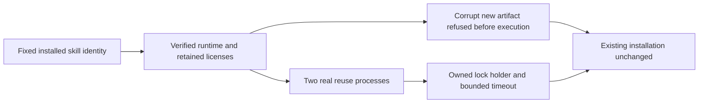

# Fixed runtime integrity acceptance

The four pinned domain CLI distributions now have complete RT-001 scenario evidence for the supported macOS arm64 matrix. The evidence binds plugin/source tags, full skill tree identity, actual runtime binary/version, archive identity, licenses, receipts and maintained provenance where present. This is verification of existing implementation; no native binaries or skill snapshots changed.

The current installed acceptance runner is maintained in ArtCraft as `scripts/verify_fixed_runtime_integrity.py`. Run it with explicit fixed `--host-receipt`, `--lock`, QA-owned `--runtime-home` and a new `--output`; it refuses an existing output or failed host before runtime access. It validates actual current installations, rejects a corrupt local artifact targeted at a distinct synthetic valid version, starts two real reuse processes, and checks an actual lock owner. Production lock budget is120 seconds; the test changes only its own in-memory budget to0.15 seconds. Film's13 missing/malformed/identity-drift receipt cases refuse download/execution and preserve files, with the original receipt restored in `finally`.

Parallel first publication and archive/path/provenance refusal are covered by63 exact-source bootstrap tests: Film20, Effect13, Photo15, Vector15. These use isolated executable fixtures; real public cold-install evidence is linked separately only after full skill hash equality. No fixture result is represented as a newly downloaded native binary.

[Scenario evidence](evidence/craft-fixed-runtime-integrity-20261008.json) closes only domain RT-001 implementation/acceptance tasks2.2/2.3. Runtime upgrade lifecycle, desktop behavior, other platforms, all command contexts, generic Skills CLI and full V1 remain open. No OpenSpec change is archived.
