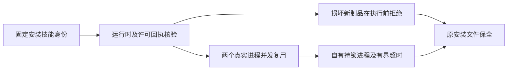

# 固定运行时完整性验收

四个领域 CLI 的 RT-001 全部场景现已形成当前受支持 macOS arm64 矩阵的完整证据。证据绑定插件／技能源标签、技能整树身份、实际运行时二进制与版本、制品身份、许可、安装回执及适用的维护来源记录。本次核验已有实现，不改变原生程序或技能快照。

验收入口集中维护于 ArtCraft 的 `scripts/verify_fixed_runtime_integrity.py`，显式传入固定 `--host-receipt`、`--lock`、QA 自有 `--runtime-home` 与新的 `--output`。已有输出或失败宿主在访问运行时前拒绝。工具核对实际安装、将本地损坏包指向不同的合法模拟版本并确认拒绝、启动两个真实复用进程、验证真实持锁者及超时。生产锁预算为120秒；验收仅缩短自身进程内预算为0.15秒，不改安装文件。Film另覆盖13种回执缺失／损坏／身份漂移拒绝，禁止下载和执行，保留现有文件，并在finally恢复原回执。

首次并行发布及制品／路径／来源记录拒绝由63项与固定安装bootstrap逐字节相等的源码测试覆盖：Film20、Effect13、Photo15、Vector15。测试使用隔离可执行fixture；公开原生冷安装证据另按技能完整摘要相等绑定，绝不把fixture当作新下载的原生程序。

[逐场景证据](evidence/craft-fixed-runtime-integrity-20261008.json)仅关闭四领域RT-001实现／验收任务2.2／2.3。运行时升级、桌面、其他平台、全量命令上下文、通用Skills CLI和完整首版仍开放。不归档OpenSpec变更。
