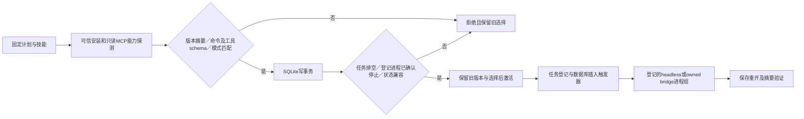

# 运行时能力与隔离选择

插件43／固定技能源37已完成VC-RT-002全部7个当前场景及任务2.6，平台为声明支持的macOS arm64。证据：[公开固定安装验收](evidence/vectorcraft-runtime-upgrade-fixed43-20261008.json)。其他平台明确拒绝；创意GUI、模型派发、逐命令执行和完整V1仍由各自门禁验收。

选择作用域是单个Harness账本；不接管用户既有桌面或其他账本。Controller默认执行headless，新任务在编辑意图前验证计划、安装固定版本、核验实际签名并初始化选择；已有不同版本不被隐式升级。相同版本并发可复用选择，相同任务键只核验原回执，不重放编辑。独立Ledger可显式登记executionMode=bridge；Controller不能以bridge替换headless。

`node src/cli.ts runtime-probe DATABASE REQUEST.json`只读探测；`runtime-activate`重新探测并选择，`runtime-status`读取选择（请求可为`{}`）。请求包含skill、expectedSkillSha256、executable、platform、python、requirements及激活时的stateSchemas。requirements绑定mode、命令ID到完整params签名、工具名到inputSchema。缺失和漂移分别返回capability_missing、capability_schema_mismatch；不能追认漂移以通过校验。bridge须显式loopback连接。状态兼容是调用方明确声明的策略，不从原生二进制自动推断；当前schema为3。探测的空文档enabled状态不代替签名，固定技能执行时仍检查当前会话前置条件。只读探测进程组受任务截止时间与最多180秒限制，失败不重试编辑；旧ready任务缺少能力指纹时须恢复核验，不能自动继续。

激活与任务登记共用SQLite写事务；ready、running、reconciling、cancel_requested或未确认停止的登记进程阻止切换。相同选择幂等并保留回退记录。schema1／2打开前先以VACUUM INTO保存包含已提交WAL的只读快照、原schema和SHA256，再在单一事务内迁移到schema3；备份失败不得迁移。旧选择未声明schema3时，须排空后重新激活。旧阅读器新开连接拒绝schema3；selected_runtime_writer触发器使升级前已打开的旧连接也核验模式、摘要和状态策略，拒绝事务不留下新任务或新预算。

| 当前场景 | 固定安装证据 |
| --- | --- |
| 合同成功与能力缺失拒绝 | 两个实际CLI版本的升级／兼容回退、原生保存重开、缺失能力保留旧选择 |
| 下载恢复及不可重试边界 | 实际空缓存公开安装；安装副本故障注入逐项分类，安装器15项测试，全部13技能字节一致 |
| 模式与schema | 真实headless和owned签名bridge；同会话命令／工具签名与版本摘要核验、漂移及替换拒绝 |
| 排空与竞争 | 活动旧CLI／登记bridge／未确认停止组拒绝；8轮双进程竞争覆盖两个先后顺序 |
| 默认首用 | 计划验证先于安装、同账本并发、原键只读、漂移拒绝、全部产物摘要 |
| 状态迁移 | 明确构造的schema1／2 fixture保留任务与WAL选择／步骤／预算；旧连接新预算回滚、备份目录链接拒绝 |

实际公开安装副本通过54项Node、43项Python和15项安装器测试；原生11项、登记bridge5项、竞争8轮、默认5项及旧连接预算保全fixture均通过。fixture不冒充历史生产数据库；原生／故障注入／宿主发现／创意验收层级保持区分。

插件42及之前的候选报告仍保留原字节和原结论；变更前源码存入证据快照，索引将受影响报告标为历史，不把旧执行摘要绑定到新实现。
