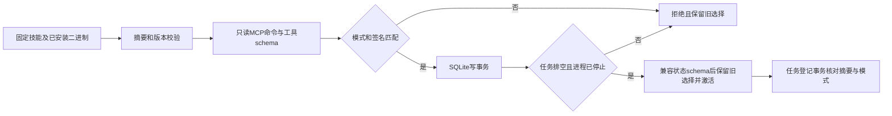

# 运行时能力与隔离选择

这是插件源码候选入口，已发布插件41尚不包含。它管理单个Harness账本的选择，不控制外部桌面、其他账本，也不安装或更新原生制品。

用 `node src/cli.ts runtime-probe DATABASE REQUEST.json` 只读探测；`runtime-activate` 重新探测后选择，`runtime-status`读取选择（请求文件可为`{}`）。请求字段：`skill`、`expectedSkillSha256`、`executable`、`platform`、`python`、`requirements`及激活时的`stateSchemas`。后者是显式兼容策略，不是从二进制推断的状态迁移能力；当前账本schema为2。

`requirements`含`mode`（headless或bridge）、`commands`（命令ID到完整params签名）、`tools`（工具名到inputSchema）。签名严格比较；缺失返回capability_missing，变化返回capability_schema_mismatch。可从已固定的技能references/command-coverage.json提取命令签名；工具schema须由计划固定，不能为通过验证而追认变化。bridge必须提供显式127.0.0.1连接，绝不回退headless。Controller当前仅执行headless；bridge选择会阻止其任务登记。

排空检查包含ready、running、reconciling、cancel_requested及未确认停止的登记进程组。复用SQLite写事务防止新任务插入；相同选择幂等，不覆盖原回退记录。切换不删除旧二进制、不自动迁移schema；不兼容回退拒绝。固定技能自己的实时enabled检查仍在执行会话内进行，探测时空文档disabled不等于不支持。

证据：[本轮候选报告](evidence/vectorcraft-runtime-gate-candidate-20261008.json)。42项Node测试与同一固定headless运行时9项原生场景通过。不同版本升级／回退、desktop GUI和完整2.6尚未验证；此前报告只代表其原执行字节，历史源码快照保存在证据目录。

默认首用流程尚未强制schema探测，需显式激活；这是2.5未完成的实现缺口。已激活后Controller会核对固定技能完整命令签名与所选能力指纹。
