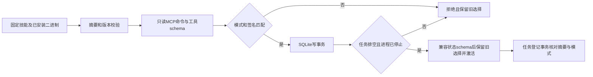

# 运行时能力与隔离选择

插件42包含本入口。它管理单个Harness账本的选择，不控制外部桌面、其他账本，也不安装或更新原生制品。

用 `node src/cli.ts runtime-probe DATABASE REQUEST.json` 只读探测；`runtime-activate` 重新探测后选择，`runtime-status`读取选择（请求文件可为`{}`）。请求字段：`skill`、`expectedSkillSha256`、`executable`、`platform`、`python`、`requirements`及激活时的`stateSchemas`。后者是显式兼容策略，不是从二进制推断的状态迁移能力；当前账本schema为3。

`requirements`含`mode`（headless或bridge）、`commands`（命令ID到完整params签名）、`tools`（工具名到inputSchema）。签名严格比较；缺失返回capability_missing，变化返回capability_schema_mismatch。可从已固定的技能references/command-coverage.json提取命令签名；工具schema须由计划固定，不能为通过验证而追认变化。bridge必须提供显式127.0.0.1连接，绝不回退headless。Controller当前仅执行headless；bridge选择会阻止其任务登记。

排空检查包含ready、running、reconciling、cancel_requested及未确认停止的登记进程组。复用SQLite写事务防止新任务插入；相同选择幂等，不覆盖原回退记录。切换不删除旧二进制；不兼容回退拒绝。固定技能自己的实时enabled检查仍在执行会话内进行，探测时空文档disabled不等于不支持。

证据：[本轮候选报告](evidence/vectorcraft-runtime-gate-candidate-20261008.json)。42项Node测试与同一固定headless运行时9项原生场景通过。该历史报告不覆盖不同版本升级／回退、desktop GUI或完整2.6；此前报告只代表其原执行字节，历史源码快照保存在证据目录。

普通Controller首用已自动接入：计划验证、固定安装、实际schema核验和首次选择均在编辑意图前完成。已选择不同版本时拒绝隐式升级；相同版本并发复用选择。相同任务键读取原回执，不重新探测或重放编辑；旧ready任务缺少能力指纹时拒绝自动迁移。显式探测／激活CLI仍可独立使用。

本轮[默认首用证据](evidence/vectorcraft-runtime-default-artifacts-candidate-20261008.json)：46项Node回归、5项真实空缓存／默认／并发／拒绝场景及8项结构修订回归通过。独立只读探测进程组受任务截止时间限制，最多180秒，失败不重试编辑。不同版本升级／回退、desktop及迁移仍由2.6验收。

插件42打开schema1／2账本时，先以VACUUM INTO保存包含已提交WAL的一致快照至state-schema-backups，文件只读，记录原schema、目标schema和SHA256；备份失败则拒绝迁移。DDL和schema3标记在同一事务提交。schema2旧阅读器明确拒绝新账本。旧选择策略未声明schema3时，必须排空后才能重新激活。Ledger可显式登记executionMode=bridge的原生任务，默认仍为headless；Controller仅执行headless。

本次[跨版本候选证据](evidence/vectorcraft-runtime-boundaries-candidate-20261008.json)覆盖实际CLI0.2.0与0.2.0-craft.2的会话排空、保留旧版、升级／回退重开及签名漂移拒绝；包含owned签名桌面bridge独立探测与原生保存／重开。完整2.6继续开放，尤其真实登记bridge会话排空、完整安装／升级矩阵及其他平台尚未验收。
