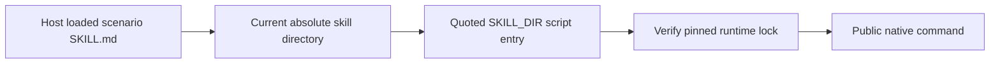

# Scenario skill installation paths

Each first-use example resolves the directory of the SKILL.md actually loaded by the host. Its user, project and plugin examples must name that same skill. A separately installed scenario skill must not require a sibling CLI skill.

Six examples across four domains previously named their generic CLI sibling. The correction changes only those path examples and aligns two suite runtime-version records with their existing locks; no native executable or runtime archive changes. The existing path check now rejects sibling examples; suite checks require each runtime lock to match suite metadata.

Validation copies all 54 domain skills into three layouts containing spaces and runs 474 documented help invocations without installation side effects. Source regressions pass with conditional native tests reported separately. [Candidate evidence](evidence/scenario-own-path-candidate-20261008.json). Fixed-tag plugin installation and actual cold runtime use remain separate release gates; this proof does not establish creative tasks or complete V1.

## Fixed installed own-directory acceptance (2026-10-08)

The current fixed host matrix is Film36/source35, Effect34/source32, Photo34/source32, Vector33/source31 and Art107/source80: 64 skills, zero loading errors. Six changed scenario skills independently install their pinned public CLI into empty caches in Unicode/space paths, then discover commands and describe parameters through their own supported entry. Runtime archives are unchanged. All 64 installed/vendored trees match; 58 historical cold records are reused only after complete digest equality.

Four source regressions total 596 tests: 474 passed and 122 conditional skips. Four plugin regressions pass all 72 tests. The path tests cover 54 skills, 162 copied installation layouts and 474 argument-parser help calls; these do not establish native creative tasks. Two auxiliary verifier mistakes are retained: unsupported cross-domain native describe and rejection of Photo’s valid dev-build version suffix. Five successful fixed cold cases were retained; Photo alone was rerun with the existing exact named version matcher. Six actual cold cases now pass.

Only the own-directory bounded release gates close; full V1, exhaustive contexts, actual generic Skills CLI and creative acceptance remain open. [Fixed installed evidence](evidence/craft-scenario-paths-fixed-first-use-20261008.json).
