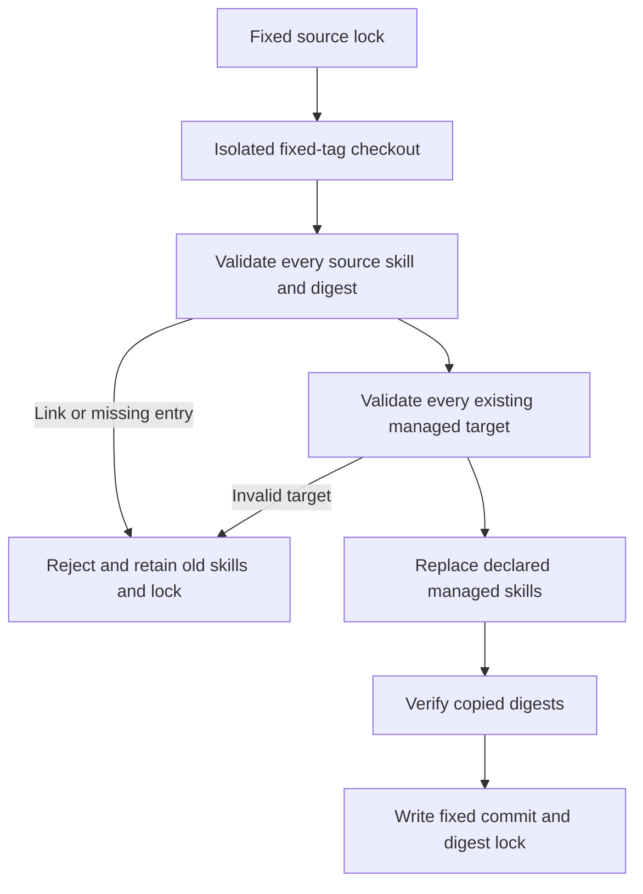

# Self-contained skill snapshots and synchronization preflight

The five plugins share this corrected source validation. Skills remain maintained in independent repositories; plugins carry copies bound to a fixed tag, commit and per-skill SHA-256. A first-use installation must contain real files rather than depend on a developer machine's symbolic-link targets.

Previously, hashing filtered entries with `is_file()`: file links were dereferenced while directory and dangling links could disappear from the inventory. Updating replaced skills one by one, so a later missing entry could leave an earlier skill changed. Failure tests reproduce both accepted links and partial replacement.

Resolution and checkout use only lightweight or annotated tags under `refs/tags`; a version-named branch is not a release. Offline checks also require a 40-character commit and a 64-character SHA-256 for every declared skill.



Hashing first rejects a linked skill root, parent directory, internal file or directory, dangling link, and special file. Regular files retain the existing sorted digest algorithm. Equal content does not make an external link distributable.

Synchronization checks all declared source checkouts, entries, complete trees and existing managed targets before any replacement. Preflight rejection preserves old skills, lock bytes, external targets and plugin-local skills. Valid updates copy declared skills and verify copied digests. This does not provide full rollback for copy-time I/O failures or all races caused by malicious concurrent filesystem replacement.

Tests cover regular digest compatibility, file/directory/root/parent/dangling links, equal-content external entry rejection, a later invalid source leaving the first target intact, existing target-link preservation, and a valid update preserving local skills. [Evidence](evidence/vendor-self-contained-20261008.json) separately records actual public-source and installed identity checks. Rejection tests and source checks do not replace native creative workflows, host installation or complete V1 acceptance.

Maintainers reproduce from the repository root:

```bash
python3 -B -m unittest discover -s tests -p 'test_skill_vendor*.py'
python3 -I -B scripts/vendor/skill_vendor.py check
```

Only maintainer synchronization and verification tools change. Published immutable skill content, native runtimes and installation locations remain unchanged. Users continue to call the public entry in the skill directory actually loaded by their host.
