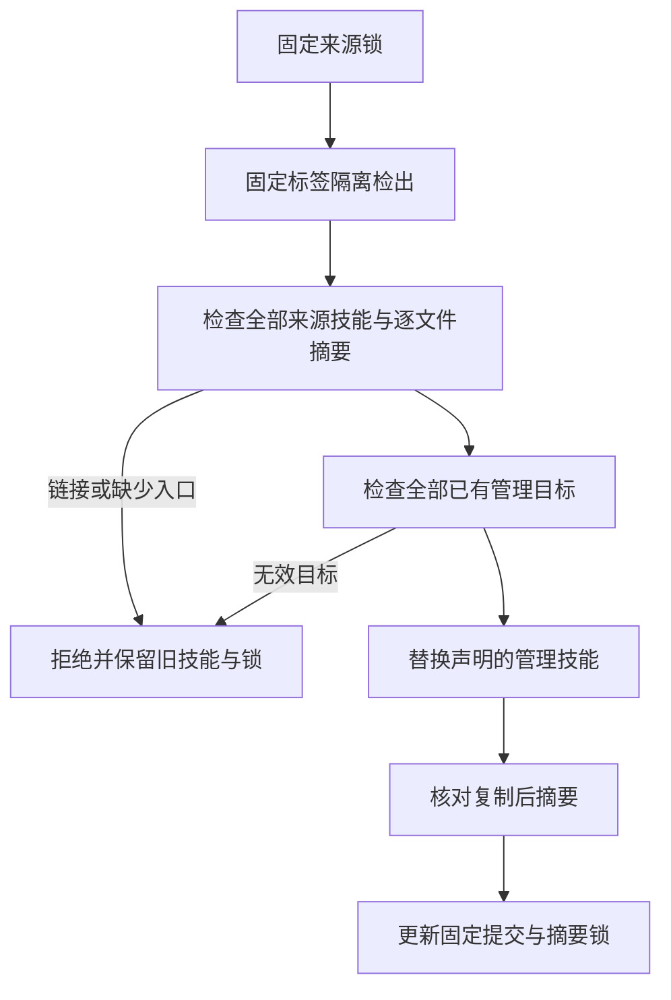

# 独立技能快照的链接拒绝与同步预检

当前实现修复五个插件共用的技能来源校验。技能仍在独立仓维护；插件只保存固定标签、提交和逐技能 SHA-256 的副本。首次安装的技能必须携带自己的真实文件，不能依赖开发电脑上的链接目标。

旧 `hash_skill_dir` 在 `is_file()` 过滤后读取文件：文件链接会被解引用，目录链接与悬空链接可能被忽略。旧同步逐个替换目标，后续技能入口缺失时已替换前面的技能。失败回归分别复现链接接受与部分更新。

来源解析与检出仅接受 `refs/tags` 下的轻量或附注标签，同名分支不属于发行来源；离线检查也要求40位提交与覆盖每项声明技能的64位SHA-256。



校验先拒绝技能根、技能父目录、任何内部文件／目录或悬空符号链接，并拒绝特殊文件；随后仅对普通文件按原排序与算法计算摘要。相同字节的链接也不能成为可分发内容。普通现有技能的摘要保持兼容。

同步先完成所有声明来源的检出、入口与完整树检查，以及所有已有管理目标检查。任何预检失败发生在替换之前，保持原技能、锁文件、链接目标和插件本地技能。正常同步复制明确声明的技能，并核对复制后摘要。它不是复制阶段 I/O 故障的完整事务回滚，也不声称防御并发恶意替换文件的全部竞态。

回归覆盖普通文件摘要兼容、文件／目录／根／父目录／悬空链接、同内容包外入口的离线拒绝、第二个来源无效时首个目标保全、旧目标链接保全及正常更新／本地技能保全。当前实际公开来源与安装身份核验单独记录于 [证据](evidence/vendor-self-contained-20261008.json)。模拟测试证明拒绝边界；来源检查证明当前固定内容；二者不替代原生创作、宿主安装或完整 V1。

维护者在仓库根目录重现：

```bash
python3 -B -m unittest discover -s tests -p 'test_skill_vendor*.py'
python3 -I -B scripts/vendor/skill_vendor.py check
```

此修改仅更新维护者的同步／校验工具，不变更已发布不可变技能内容、原生运行时或其安装位置。用户继续从宿主实际加载的技能目录调用自身公开入口。
