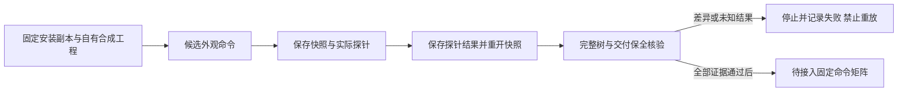

# 外观命令验收失败诊断检查点

此检查点交付QA代码与失败记录，不交付appearance通过结论。唯一规格事实源仍为OpenSpec的VC-CM-001；任务8.3保持开放，121/127任务完成、6项开放。已通过外置命令矩阵仍为110/585。

[机器记录](evidence/vectorcraft-appearance-diagnostic-fixed64-20261009.json)只包含自有合成夹具的脱敏失败阶段、原始记录摘要与未知请求。a2的活动行探针执行paint.setFill与edit.undo后，document.json表明内存恢复；随后保存重开缺少对象2而保留文字3。内存相等不足以证明落盘保全。a3是新建自有会话，在effect.apply请求处停止，结果未知；不能视为未执行，也不能重放。两次失败记录均确认自有进程停止。

失败运行没有生成完整family proof，执行时驱动摘要未记录；当前候选摘要只标识后续代码，不补签历史运行身份。现有记录不能确定问题在引擎、GUI同步还是验收夹具。原始本地工程、图像与日志保留于忽略目录，不上传个人路径或媒体。

候选探针改为先保存自有快照、执行实际编辑／创建探针并保存结果，再打开快照恢复；不再依赖尚未验收的undo链。该修改尚未通过完整16命令、32轮保存重开、64份导出及48组图像比较，不提升任何命令通过数。

`scripts/qa/command_appearance.py`和`command_appearance_render.py`是未验收候选。`tests/test_command_appearance.py`核验独立堆栈公式；`tests/test_command_appearance_diagnostic.py`核验失败事实与不提升状态，两者均不能代替原生正向验收。18项正向／篡改证据用例完整保留在`scripts/qa/pending/test_command_appearance_evidence.py`；因通过报告缺失且聚合校验器尚未接入appearance，目前不属于常规回归集。后续必须先在全新自有会话完成原生运行、生成绑定身份的报告并接入聚合校验器，再将正向测试纳入常规发现；不能用跳过或改写断言取得通过。

本次只补充dev.64开发发布的诊断资产及QA提交。固定产品标签、13技能快照和独立源46不变；模型路由、宿主秘密引用、偏好重启持久化、全命令GUI和完整V1仍未验收。
