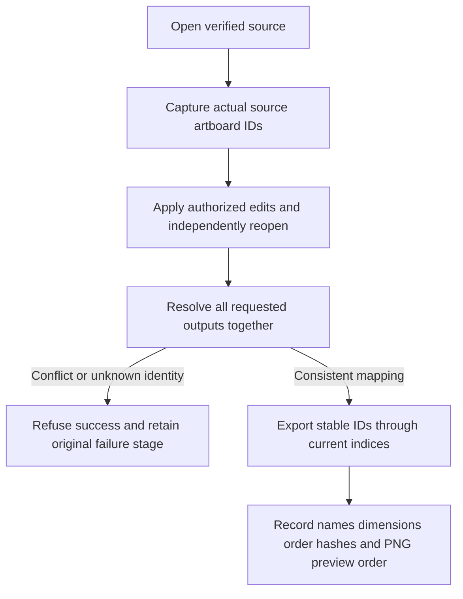

# Stable artboard IDs and export mapping

Plugin54 pins independent source40. Legacy zero-based creation indices remain supported. Revisions bind legacy indices to IDs read from the actual opened source, refusing post-operation identity shifts. Explicit artboardId follows the current order; providing both index and ID requires agreement. When native artboard.new returns only an index, the workflow immediately queries the same session and enriches the alias with the actual ID, retaining the raw native receipt.

Paths artboard-N retain current-index-plus-one naming; filenames are not stable cross-version identities. artboards lists native IDs, names, rectangles, document-unit dimensions and indices. artboardOrder is native order; outputs preserves request order with actual ID/index; previewOrder lists PNG request order only. All mappings are checked before the first export, including duplicate format/ID combinations. Newly added indices without a corresponding original source board remain usable; explicit creation-ID bindings are preferred.

Actual fixed53 reproduces ignored explicit IDs and silent index shifts. Source40 passes nine mapping tests and three native successful mappings/four original-stage refusals, decoding14 SVG/PNG/PDF dimensions and PNG colors. Source regression:190 total,160 passed,30 native-condition skips. Full4.12 still requires SVG paint-bounds isolation across locked/stroked/effected/grouped/clipped/unknown content and PDF cross-time identity contracts. Fixed installation, GUI and full V1 remain separate.

Public fixed54/source40 passes actual Codex0.153.4 isolated installation/discovery of13 skills, three successful installed-copy mappings/four refusals and14 decoded outputs;13 skill digests unchanged. Pinned runtime reused. This mapping subset does not close full4.12. [Fixed subset evidence](evidence/vectorcraft-artboard-mapping-fixed54-20261009.json).
