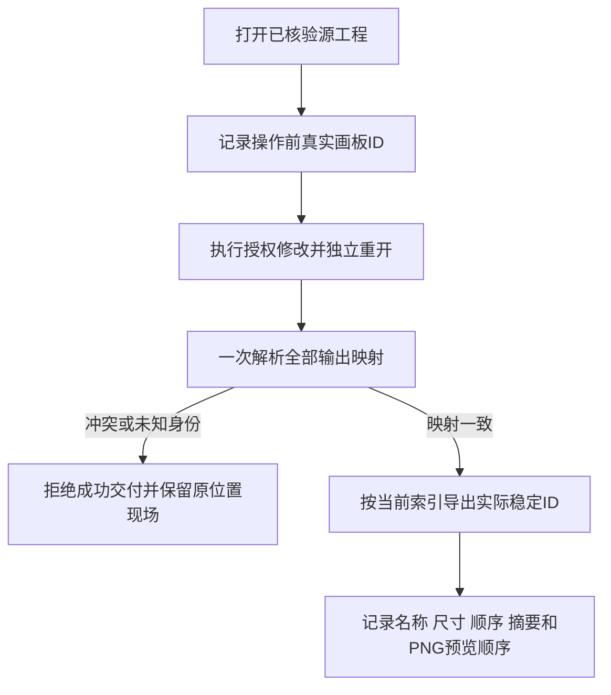

# 画板稳定ID与导出映射

插件54锁定独立技能源40。旧零基索引创建计划保持兼容；返工先从实际打开的源工程取得画板ID。仅按旧索引请求时，操作后索引改变身份即拒绝；显式artboardId跟随当前顺序，ID与索引同时提供必须一致。原生artboard.new只给索引时，工作流查询同会话真实画板并补充ID到别名，原始原生回执仍保留。

输出路径artboard-N沿用当前索引加一，文件名不是跨版本身份。artboards列出当前原生ID、名称、矩形、文档单位尺寸与索引；artboardOrder是原生顺序，outputs是请求顺序并附实际ID／索引；previewOrder仅列PNG输出顺序。全部映射在第一份导出前校验，重复格式／ID组合也拒绝。新增且原源工程无对应索引的画板仍可按当前索引导出，推荐显式创建绑定ID。

原生固定53复现忽略显式ID及静默索引偏移；源40九项映射测试、三种成功映射／四种原位置拒绝通过，14份SVG／PNG／PDF尺寸及PNG颜色独立解码通过。源码190项中160项通过、30项原生条件跳过。完整4.12仍需覆盖锁定／描边／效果／群组裁切／未知绘制范围的SVG隔离及PDF跨时刻合同；固定安装、GUI与完整V1分别验收。

公开固定54／源40已通过Codex0.153.4隔离安装与13技能发现，实际安装副本三种成功映射、四种拒绝及14份输出解码通过，13技能摘要保持；复用已核验运行时。仅映射子集，不关闭完整4.12。 [Fixed subset evidence](evidence/vectorcraft-artboard-mapping-fixed54-20261009.json).
