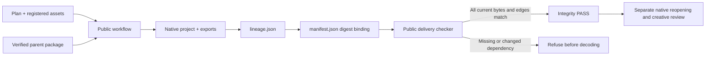

# Artifact lineage

Plugin57 pins source43. The workflow records stable logical IDs, content-addressed package versions, execution IDs, plan hashes, native projects, derivatives and registered assets. Whole-package movement uses relative paths. Revisions validate the parent before runtime installation and preserve logical identity; legacy packages record an explicit unversioned parent.

The checker verifies all files and semantic edges before decoding. Old packages remain readable with lineageStatus NOT_RUN. This is package identity verification, not external task authentication, native reopening or creative acceptance. Source five tests and public three tests include rehashed semantic faults. Native candidates create, move/reopen and revise with five integrity refusals; fixed installation task5.3 remains open.

[Candidate evidence](evidence/vectorcraft-lineage-candidate57-20261009.json).
