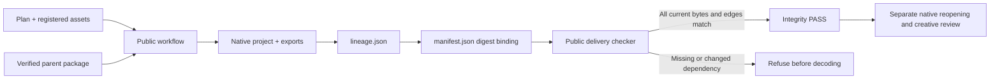

# Artifact lineage

Plugin57 pins source43. The workflow records stable logical IDs, content-addressed package versions, execution IDs, plan hashes, native projects, derivatives and registered assets. Whole-package movement uses relative paths. Revisions validate the parent before runtime installation and preserve logical identity; legacy packages record an explicit unversioned parent.

The checker verifies all files and semantic edges before decoding. Old packages remain readable with lineageStatus NOT_RUN. This is package identity verification, not external task authentication, native reopening or creative acceptance. Source five tests and public three tests include rehashed semantic faults. Native candidates create, move/reopen and revise with five integrity refusals; fixed installation task5.3 remains open.

[Candidate evidence](evidence/vectorcraft-lineage-candidate57-20261009.json).

Plugin58 corrects public checker imports to preserve immutable installed skill bytes. The actual57 CI cache-write failure is retained; its read-only regression failed on57 and passes on58. All74 Python tests pass locally; fixed58 qualification remains pending. [Evidence](evidence/vectorcraft-lineage-candidate58-20261009.json).

Actual public58/source43 installed on Codex0.153.4 macOS arm64 passes all three current VC-AR-001 scenarios: native creation, whole-package movement/reopen, parent-bound revision and public seven-case validation. All13 installed skill digests remain unchanged. Task5.3 closes;114/127 complete,13 open. Creative quality and other platforms remain separate. [Evidence](evidence/vectorcraft-lineage-fixed58-20261009.json).
