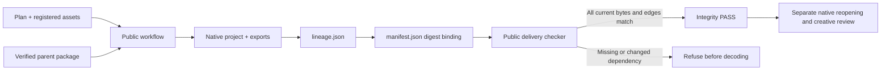

# 产物血缘

插件57锁定源43。公开工作流登记稳定逻辑ID、内容寻址包版本、执行ID、计划摘要、原生工程、导出和登记素材。整包移动使用相对路径；修订在安装运行时前验证父包，保留逻辑身份。历史包明确登记无版本父来源。

公开校验先核对全部文件和语义依赖，再解码。旧包仍可读取，血缘状态为NOT_RUN。该校验只证明包内身份一致性，不证明外部任务认证、原生重开或创作验收。源五项测试、公开三项测试覆盖重签摘要后的语义错配。原生候选已完成创建、移动重开、修订及五类拒绝；固定安装任务5.3仍开放。

[候选证据](evidence/vectorcraft-lineage-candidate57-20261009.json)。
