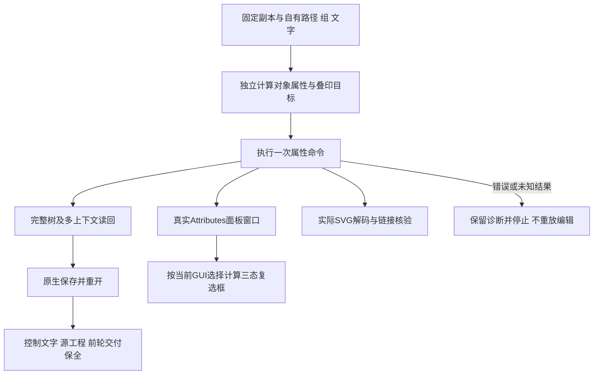

# 属性面板固定安装验收

逐命令属性固定安装增量：公开dev.64/source46实际安装副本完成2条attributes命令、4轮原生保存重开、8份解码SVG/PNG及4张真实Attributes面板窗口。独立完整树核验组内绘制叶、文字字符与外观行的叠印目标差异、唯一对象变更计数、混合属性／填充规则／直线矩形方向读回、默认中心点与空属性清理、字符串去空白，以及会话内去重10条URL历史。第二轮先修改自有控制对象名称；控制文字、源工程、前轮交付及13安装技能身份保全。6组画布／PNG／窗口比较通过，普通模式艺术像素保全；4份额外SVG按完整树独立解码核验链接，8项固定布局复选框像素检查区分混合横线／勾选／未勾选。38项新增回归通过；旧136命令矩阵及校验器保留，当前138/585通过、447 NOT_RUN、276轮保存重开、552份解码导出。此证据不提升印刷叠印模拟、曲线方向、重启后URL历史、undo、模型、全GUI或完整V1；8.3保持开放，121/127完成、6项开放。

[原生证据](evidence/vectorcraft-command-attributes-fixed64-20261009.json)绑定实际安装副本、驱动、原生运行时、合成工程、参数与返回值。上游固定提交90e022b0c05f12171a4e9bebe0894fa62f7bc95c仅提供静态语义参考，不证明已编译二进制完全对应源码。

GUI始终选择自有路径与自有文字；显式ids查询另可指向路径与组、文字的指定外观行。二者不能混用。窗口实际1440×900、1×；固定布局下填充与描边复选框区域分别为[851,159,13,13]、[951,159,13,13]，混合横线区域位于各框内部。独立模型计算的三态决定蓝色／灰色横线像素断言，逐项绑定截图摘要；这些坐标只用于本轮布局。面板中矩形映射、URL与备注的出现和清除也已直接查看，像素自动断言仅覆盖两项叠印复选框。

a1已有原生通过报告，但窗口只有Properties面板；a2显式打开Attributes后完整复验。新驱动将叠印预览关闭，只验证叠印标志、属性元数据和普通输出；不冒称印刷仿真。10条URL历史属于拥有的原生会话，不推断文件或重启持久性。没有执行Browser按钮，也没有访问example.invalid的链接。公开证据不含用户媒体、项目二进制、图片或本地缓存。
