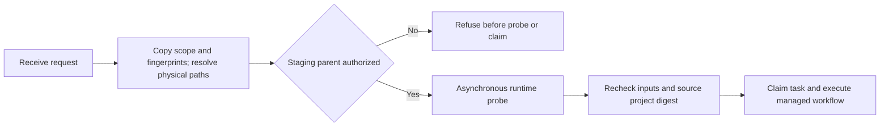

# Authorization snapshots and staging roots

Plugin dev.44 copies authorization and input fingerprints before asynchronous runtime probing and resolves request paths and authorization roots to physical paths. Later caller mutations and alias changes cannot broaden the captured scope or redirect delivery. Staging uses the output parent, so permission for only the final output directory is insufficient; refusal precedes probing and task registration. Source project digests are also checked during supervision, and symbolic-link source project files are refused.

The behavior contract is [VC-TX-001](../openspec/changes/establish-v1-plugin/specs/task-execution/spec.md). Three coordinator tests use an explicit synthetic workflow to cover staging-parent refusal, root alias switching and caller mutation of input fingerprints and authorization. They do not establish native single-writer safety, GUI concurrency or completion of task3.3. Complete V1 remains open.

