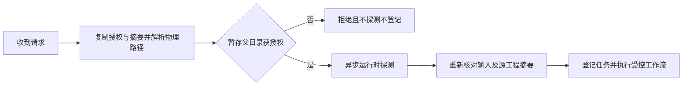

# 授权快照与暂存目录边界

插件 dev.44 在 Controller 的异步运行时探测前复制授权和输入摘要，并将请求路径及授权根目录解析为物理路径。调用方随后修改原对象或目录别名，不得扩大字段、对象、目录范围或重定向交付。暂存工程创建在输出父目录，因此仅授权最终输出目录不足以授权暂存写入；该情况在探测与任务登记前拒绝。源工程摘要在监督期间继续核对，源工程文件符号链接拒绝执行。

行为规范属于 [VC-TX-001](../openspec/changes/establish-v1-plugin/specs/task-execution/spec.md)。三个协调器测试使用明确的合成工作流，覆盖暂存父目录拒绝、目录别名切换及调用方输入摘要／授权修改。它们不证明原生工程单写、GUI并发或完整任务3.3通过；完整V1继续开放。

