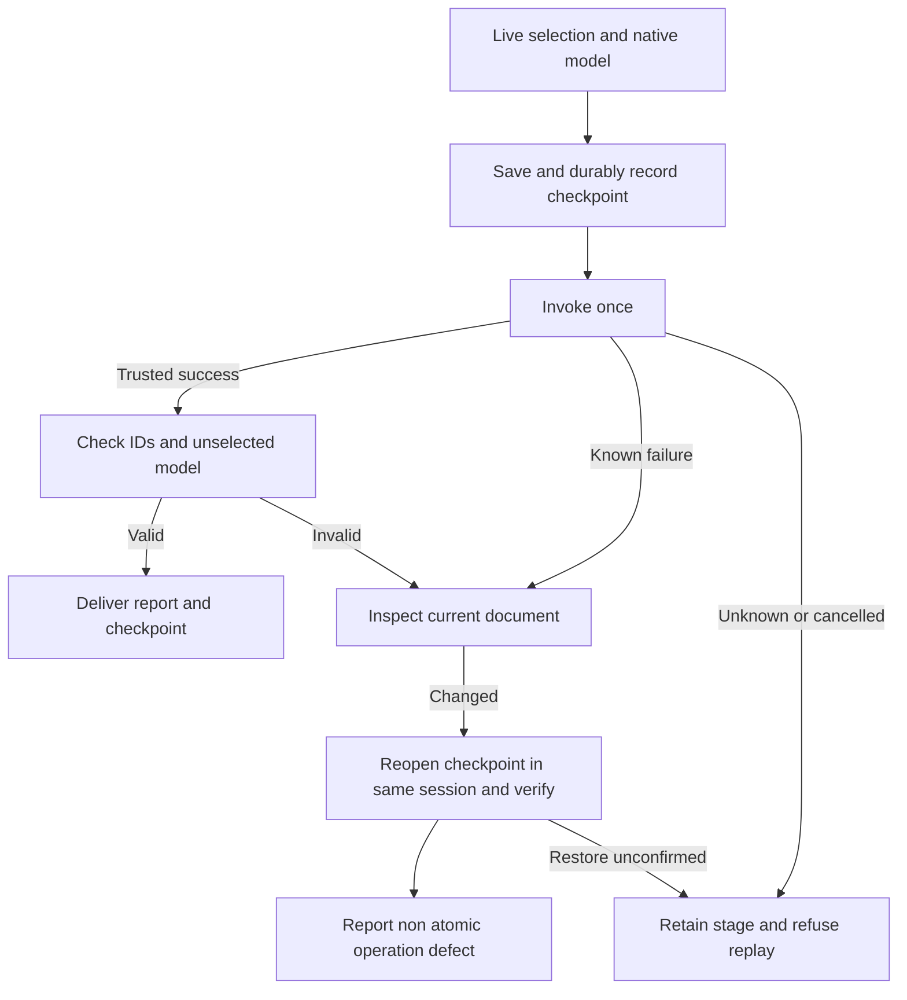

# Group and boolean transaction source candidate

All four current VC-DM-002 scenarios passed against public installed51/source38; task4.6 is complete.14 native workflow cases,8 managed authorization cases,2 native SDK selection/subtree refusals and17 source tests passed;13 skills remain unchanged and9 Harness registered groups stopped. Known/unknown faults were explicitly injected after actual native success; this is not an engine defect report. GUI,all Pathfinder contexts and creative topology judgments remain separate. [固定验收 / Fixed acceptance](evidence/vectorcraft-boolean-fixed51-20261009.json).

Direct workflow commands, `native.command` and complete command plans share `boolean_transactions.py`. Group/ungroup and Pathfinder calls read live selection from document.inspect and the complete object tree from document.json. A retained checkpoint and durable submitted record precede one mutation. `boolean-transactions.json` binds command, participant/result IDs, checkpoint digest and state. Delivery manifests include checkpoints and the report. Checks compare unselected subtrees, ancestor properties, hierarchy order and document fields; grouping retains child contents and ungrouping checks released identities.

Known semantic or verification failure with a changed document reopens the checkpoint in the same valid session, verifies the complete model, restores selection and raises `non_atomic_operation_defect`. An unchanged document retains its original failure. Timeouts, disconnection, cancellation, epoch/source conflicts never trigger automatic recovery or replay; unconfirmed restoration stays unknown. Existing failure preservation retains the original stage.

When asset collection changes the delivery root, an independent session packages each checkpoint. Full models are compared, replacing only link paths and copied mtimes with actual content SHA values. Checked links and the packaged checkpoint identity enter the report, allowing moved deliveries to reopen prior objects and dependencies.

[Candidate evidence](evidence/vectorcraft-boolean-transactions-source-candidate-20261008.json) covers14 real native cases: direct/gateway four boolean operations and grouping, complete group/ungroup, linked-asset checkpoint relocation and explicit known/unknown post-success fault injection. Injected failures do not establish an existing native engine defect. At that candidate checkpoint, all Pathfinder contexts, curve topology correctness, GUI concurrency, creative judgments and fixed-release installation remained open. Historical optimization reports retain original execution fingerprints; CI verifies this new candidate without rebinding old evidence.

## Managed structural authorization in source37

The source37 increment requires explicit `structure` permission. Selection must match authorized actual IDs; structural edits require every selected descendant ID, and result IDs plus unaffected model fields are verified again. `kind` permission does not imply structural permission. Eight real Harness cases cover direct/gateway group, ungroup and unite plus refusal before mutation. At that historical source37 checkpoint, full4.6, GUI and creative acceptance remained open. Source174 tests ran:144 passed and30 environment skips. Earlier proof is retained in boolean-transactions-before-managed-20261008.json at its original fingerprints.
