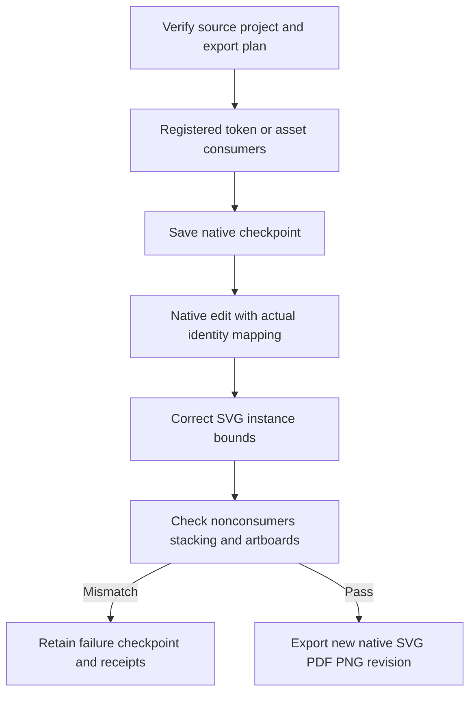

# Registered brand asset revision

Plugin56 pins independent source42. Registered raster/SVG consumers follow real native identities; native SVG replacement scaling is corrected to preserve instance bounds. Ten targeted units, source172-pass/30-skip regression, nine native asset exports and three byte-identical unrelated outputs pass; two swatch routes and eight mutation refusals regress successfully. Tasks4.16/4.17 close:110 complete/17 open. Task4.18 awaits public fixed56 installation and all current scenarios.

[Candidate evidence](evidence/vectorcraft-brand-variants-candidate56-20261009.json).
