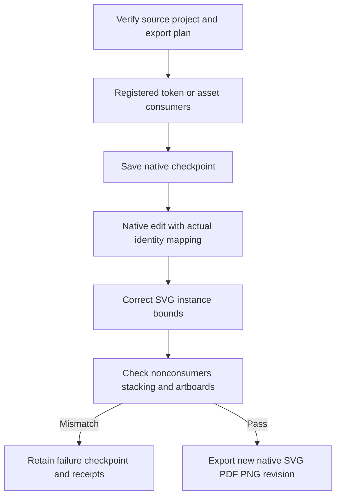

# Registered brand asset revision

Plugin56 pins independent source42. Registered raster/SVG consumers follow real native identities; native SVG replacement scaling is corrected to preserve instance bounds. Ten targeted units, source172-pass/30-skip regression, nine native asset exports and three byte-identical unrelated outputs pass; two swatch routes and eight mutation refusals regress successfully. At the candidate stage tasks4.16/4.17 closed; fixed qualification follows below.

[Candidate evidence](evidence/vectorcraft-brand-variants-candidate56-20261009.json).

Actual public56/source42 isolated Codex0.153.4 installation qualifies all six current VC-DM-006 scenarios with13 unchanged skill digests. Two swatch routes,eight erroneous-update refusals,two raster and two SVG consumers,nine asset export decodes,three unchanged unrelated SVG/PDF/PNG outputs,unknown-token refusal and both linked-plan refusals pass. Failed checkpoints reopen independently without replay. Task4.18 closes:111 complete/16 open. GUI,model creative quality,other platforms,all formats,cross-file/external-editor behavior,Art bundled distribution and full V1 remain unverified. [Evidence](evidence/vectorcraft-brand-variants-fixed56-20261009.json).
