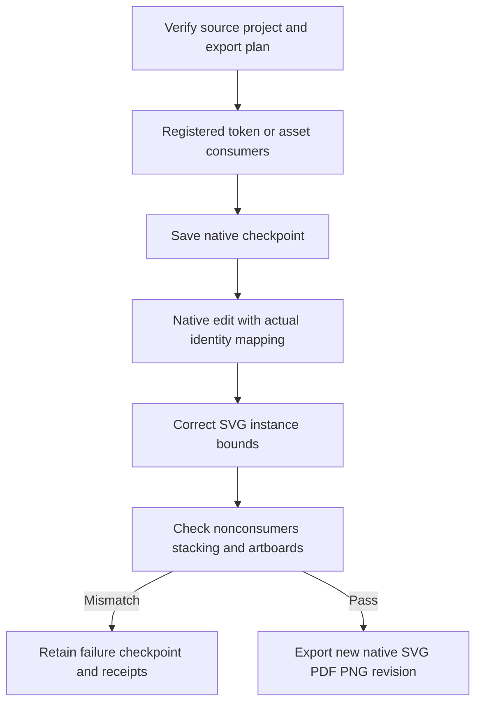

# 登记品牌素材返工

插件56锁定独立技能源42，登记品牌素材的栅格／SVG消费者只按真实回执替换；原生SVG导入缩放缺口通过实例边界校正修复。十项目标单元测试、源172通过／30跳过回归、原生九份素材输出与三份无关输出字节保全通过；色板两入口及八类误改拒绝回归通过。候选阶段完成4.16／4.17；固定完整验收见下。

[Candidate evidence](evidence/vectorcraft-brand-variants-candidate56-20261009.json).

固定插件56／源42在Codex0.153.4隔离安装副本通过VC-DM-006全部六个当前场景，13技能摘要保持。品牌色板两入口、八类误改拒绝、登记栅格／SVG各两实例替换、九份素材输出解码、三份无关SVG／PDF／PNG字节保全、未知色板及两入口符号链接清单拒绝通过；失败检查点独立重开且不重放。任务4.18完成，当前111项完成／16项开放。GUI、模型创作质量、其他平台、全部素材格式、跨文件／外部编辑器、Art捆绑包和完整V1分别保持未验。 [Evidence](evidence/vectorcraft-brand-variants-fixed56-20261009.json).
