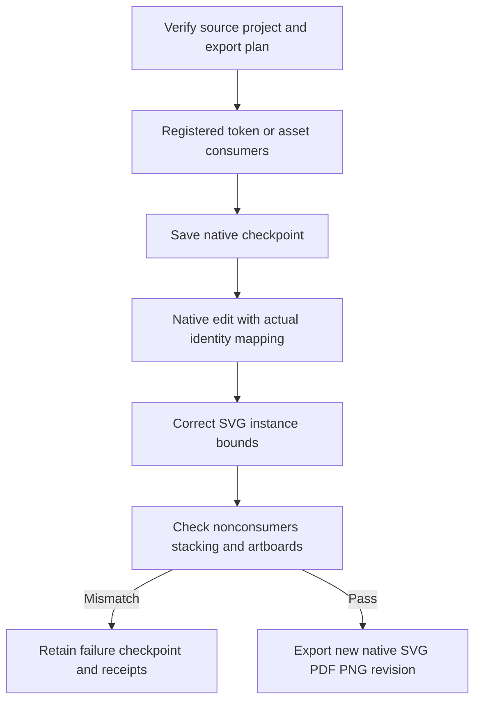

# 登记品牌素材返工

插件56锁定独立技能源42，登记品牌素材的栅格／SVG消费者只按真实回执替换；原生SVG导入缩放缺口通过实例边界校正修复。十项目标单元测试、源172通过／30跳过回归、原生九份素材输出与三份无关输出字节保全通过；色板两入口及八类误改拒绝回归通过。完成4.16／4.17，当前110项完成／17项开放；4.18待公开固定56实际安装及全部当前场景复验。

[Candidate evidence](evidence/vectorcraft-brand-variants-candidate56-20261009.json).
