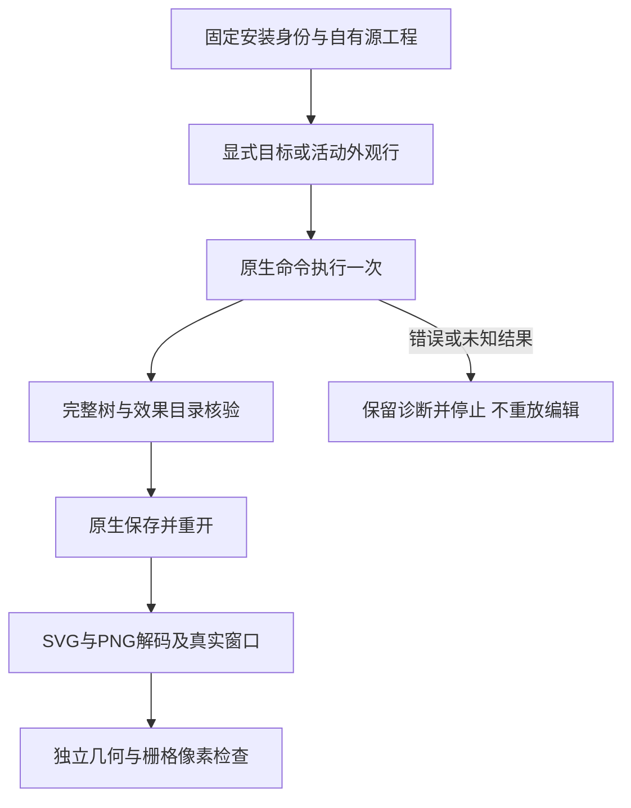

# 效果命令固定安装验收

逐命令效果固定安装增量：公开dev.64/source46实际安装副本完成全部7条effect命令、14轮原生保存重开、28份解码SVG/PNG和14张真实拥有窗口。独立核验45项完整效果目录、参数合并、活动行与显式目标、堆栈复制／移动，以及几何、描边轮廓、阴影／模糊栅格、文字轮廓、裁切标记、变换副本和容器展开。两项嵌入PNG按源边界与72ppi公式核验区域、摘要、透明度和像素；21组画布／PNG／窗口比较完成。13安装技能身份、控制文字、源工程及前轮交付保全。汇总133/585通过、452 NOT_RUN、266轮保存重开、532份解码导出；42项新增回归通过。未覆盖全部效果／画笔／符号变体，不提升undo、模型、秘密边界、全GUI或完整V1；8.3仍开放，121/127完成、6项开放。

[执行证据](evidence/vectorcraft-command-effect-fixed64-20261009.json)绑定实际安装副本、驱动、运行时、源工程、每轮参数及返回值。45项目录期望由storytold/vectorcraft固定提交90e022b0c05f12171a4e9bebe0894fa62f7bc95c的源码独立提取；该源码只提供静态语义参考，不证明已编译二进制完全对应。

阴影图35×31、模糊图19×19；按2pt安全边距、模糊外扩和位移计算位置。阴影内部覆盖扣空、外侧为黑色；半像素抗锯齿边界保留的88个源色像素单独记录。文字轮廓的knockout明确为off，裁切包装组保留原始实时几何。窗口实际逻辑1440×900，物理1×／2×，差异分析归一至1440×900；不宣称默认1280×1024验收。

早期QA目标行、图层选择、文字knockout及裁切包装预期失败保留于私有记录；修正验收夹具后全族新会话通过，没有修改产品或技能。公开材料仅含脱敏合成工程结构及摘要，不含图像、二进制或本地缓存。旧126命令矩阵及校验器原字节保留。
