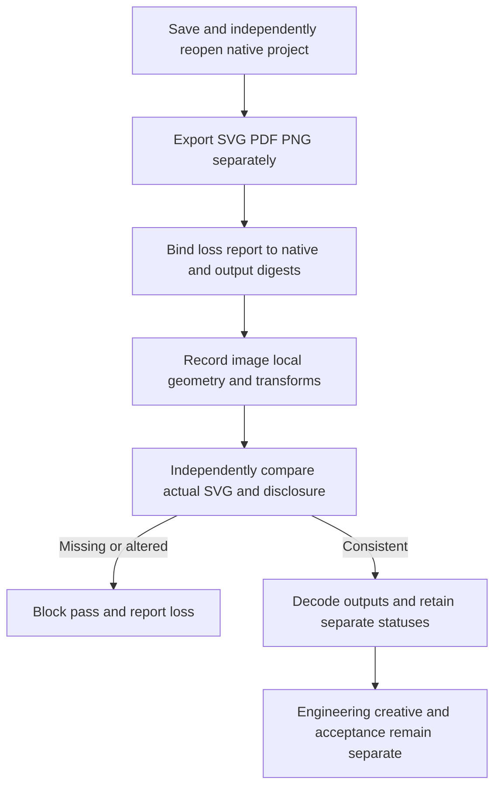

# SVG image scope and exchange validation

Plugin55 pins source41. Native projects, SVG, PDF and PNG retain separate identities and validation results. SVG loss reports list actual image/feImage local geometry, ancestor transforms and reference/payload digests. Embedded raster, embedded SVG and unresolved references remain distinct. Element rectangles do not establish complete paint bounds or effect provenance; filters alone do not establish rasterization.

vectorOnly means no image/foreignObject elements observed; it does not prove semantic fidelity. losslessVectorClaimAllowed stays false. Fonts, effects and cross-editor round trips may remain unknown; deliver the native project separately.

Technical preview allows only bounded, genuinely decoded embedded PNG/JPEG. External resources and nested SVG remain blocked. Missing decoders are NOT_RUN. SVG images require a current digest-bound loss report and native inspection identity. Missing disclosure, wrong scope, an unblocked lossless claim or changed SVG cannot be overridden by a decoder PASS. Faults are explicit mutations of copies; original artifacts remain intact.

Candidate evidence covers vector, live-filter and expanded-raster native reopening, nine independent SVG/PDF/PNG decodes and four disclosure refusals. Fixed55 installation and full4.15 are recorded separately; GUI, creative quality, other platforms and complete V1 remain open.

Public fixed55/source41 passes isolated Codex0.153.4 installation/discovery of13 skills,three installed-copy native reopen cases,nine SVG/PDF/PNG decodes and four disclosure refusals;13 digests unchanged,pinned runtime reused. Only4.13/4.14 close,107 complete/20 open.4.15 still needs automatic fallback or explicit refusal for nonexchangeable live effects and preservation of the original live-effect project. The explicit effect.expandAppearance case does not establish that behavior. [Fixed subset evidence](evidence/vectorcraft-exchange-fixed55-20261009.json).
