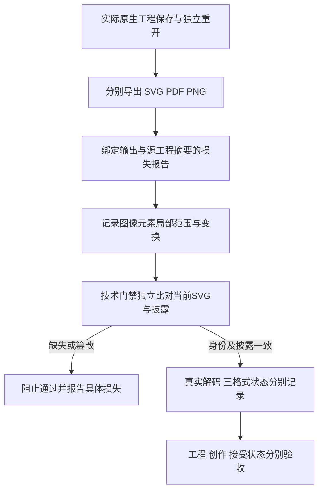

# SVG 栅格范围与交换验证

插件55锁定技能源41。原生工程、SVG、PDF和PNG各自保留身份与验证结果。SVG损失报告列出实际image／feImage元素的局部几何、祖先变换、引用及内嵌载荷摘要；内嵌栅格、内嵌SVG和未知引用分别记录。元素框不等于完整绘制范围，图像来源也不能仅凭导出反推为效果展开；滤镜存在不证明栅格化。

vectorOnly仅表示未发现图像／foreignObject元素，不证明语义无损。losslessVectorClaimAllowed始终为false；字体、效果与跨编辑器往返仍可能未知，原生工程单独交付。

技术预览只放行有界、真实解码的内嵌PNG／JPEG；外部资源与嵌套SVG仍拒绝。解码器缺失为NOT_RUN。含图像的SVG必须有摘要绑定的当前损失报告及原生检查身份；缺失披露、错误范围、放开无损声明、改动SVG均不得由一个解码PASS覆盖。所有故障注入在副本中明确标记，原工程保留。

候选：纯矢量、实时滤镜和展开栅格三类工程分别重开，九份SVG／PDF／PNG独立解码，四类披露故障拒绝。固定55安装与完整4.15另行登记；不提升GUI、创作、其他平台或完整V1。

历史子集记录（正式验收见下）：公开固定插件55／源41通过Codex0.153.4隔离安装与13技能发现，实际安装副本的三类原生重开、九份SVG／PDF／PNG解码和四类披露拒绝通过，13技能摘要保持，运行时复用。仅关闭4.13／4.14，107项完成／20项开放；4.15仍缺不可交换实时效果的自动导出退化或明确拒绝，以及原始效果工程保全验收。显式effect.expandAppearance案例不代替该证据。 [Fixed subset evidence](evidence/vectorcraft-exchange-fixed55-20261009.json).

历史子集记录（正式验收见下）：本次补充固定55自动自由渐变退化验收：未调用展开命令，SVG实际产生32×22内嵌PNG，局部范围12,16,60,40；三格式独立解码、七类拒绝通过。原生渐变独立重开后可在新修订编辑，源工程和原导出摘要保持。4.15仍待正式规格闭环核验，不据此宣称GUI、模型或完整V1通过。 [Evidence](evidence/vectorcraft-exchange-automatic55-20261009.json).

固定55／源41的VC-DM-005-P与VC-DM-005-N两个当前场景完成正式核验，任务4.15标记完成，当前108项完成／19项开放。自动自由渐变直接导出SVG产生32×22内嵌PNG，报告局部范围12,16,60,40及无损声明阻断；原生工程独立重开后可编辑渐变，新修订保留源工程与既有交付。SVG／PDF／PNG分别解码，七类披露与格式异常拒绝通过；六项证据校验测试含五项重新散列后的缺失／篡改拒绝。GUI、模型、其他平台、通用往返保真和完整V1仍未验证。 [Evidence](evidence/vectorcraft-exchange-qualified55-20261009.json).
