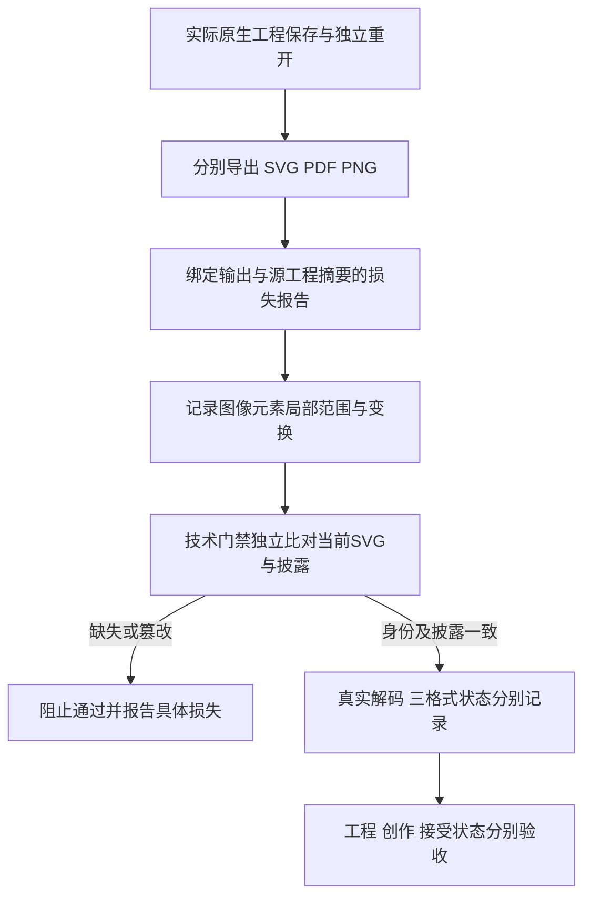

# SVG 栅格范围与交换验证

插件55锁定技能源41。原生工程、SVG、PDF和PNG各自保留身份与验证结果。SVG损失报告列出实际image／feImage元素的局部几何、祖先变换、引用及内嵌载荷摘要；内嵌栅格、内嵌SVG和未知引用分别记录。元素框不等于完整绘制范围，图像来源也不能仅凭导出反推为效果展开；滤镜存在不证明栅格化。

vectorOnly仅表示未发现图像／foreignObject元素，不证明语义无损。losslessVectorClaimAllowed始终为false；字体、效果与跨编辑器往返仍可能未知，原生工程单独交付。

技术预览只放行有界、真实解码的内嵌PNG／JPEG；外部资源与嵌套SVG仍拒绝。解码器缺失为NOT_RUN。含图像的SVG必须有摘要绑定的当前损失报告及原生检查身份；缺失披露、错误范围、放开无损声明、改动SVG均不得由一个解码PASS覆盖。所有故障注入在副本中明确标记，原工程保留。

候选：纯矢量、实时滤镜和展开栅格三类工程分别重开，九份SVG／PDF／PNG独立解码，四类披露故障拒绝。固定55安装与完整4.15另行登记；不提升GUI、创作、其他平台或完整V1。
