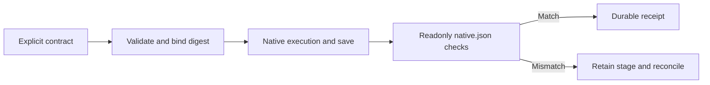

# Native geometry contract and verification

Development prerelease dev.40 includes VC-DM-001 tests and minimal implementation (4.1/4.2); full4.3 remains open.

Supply optional `geometryContract` to `Controller.run`. Schema is `vectorcraft-geometry-contract/v1`; units are `Pixels` or `Points`, coordinateSpace is `document` or `artboard-local`, and tolerance is0 through0.001. `artboards` declare native integer IDs and `[x0,y0,x1,y1]`. Each `paths` entry declares exactly one `objectId` or native receipt `binding` such as `curve.id`, plus `artboardId`, `subpaths` and `strokes`. Subpaths contain `closed` and `anchors`; anchors specify `p`, optional `in`/`out` controls and `kind`. Strokes specify `width` and native `paint` objects.

Strict validation precedes execution and the contract digest binds input identity. After saving, verification reads manifest-bound native.json, adds native artboard offsets to local coordinates and checks controls, closure and strokes. Actual IDs and project/runtime/contract digests enter the durable step receipt. Changed contracts conflict on the same key. Unknown transform contexts fail verification; preview pixels are never path facts.

Unit or closure failures report actual object IDs. Post-execution failure retains the original stage and refuses automatic replay; the existing recovery mechanism must reconcile it. Requests without a contract preserve existing behavior.

Seven targeted tests and three real native cases cover Pixels/Points, offset artboards, curved controls and retained closure failure. See [candidate evidence](evidence/vectorcraft-geometry-candidate-20261008.json). Arbitrary transforms, native reopening, GUI and real creative acceptance remain unqualified. Geometry and revision use pinned source dev.36 without changing independent skill snapshots.
