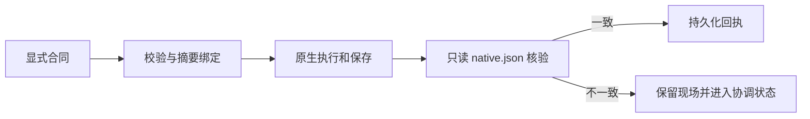

# 原生几何合同与核验

开发版 dev.40 包含 VC-DM-001 的测试和最小实现（4.1／4.2）；完整4.3继续开放。

调用 `Controller.run` 时可提供 `geometryContract`。版本为 `vectorcraft-geometry-contract/v1`，单位必须是 `Pixels` 或 `Points`，坐标空间必须是 `document` 或 `artboard-local`，容差为0到0.001。`artboards` 声明原生整数ID与 `[x0,y0,x1,y1]`；`paths` 使用唯一 `objectId` 或原生回执 `binding`（例如 `curve.id`），并声明 `artboardId`、`subpaths` 与 `strokes`。子路径包含 `closed` 与 `anchors`，锚点提供 `p`、可选 `in`／`out` 控制点和 `kind`。描边包含 `width` 与原生 `paint` 对象。

合同在执行前严格校验并绑定输入摘要。保存后只读核对清单绑定的 native.json，将画板局部坐标加原生画板偏移后检查控制点，逐项核对闭合性与描边。真实ID、工程／运行时／合同摘要及结果进入持久化步骤回执；同键改变合同拒绝执行。未知变换上下文拒绝验收，预览像素不作为路径事实。

闭合性或单位不符时报告真实对象ID。执行后的失败保留原始阶段，禁止同键自动重放；继续操作需原有恢复机制核对现场。无合同请求保持既有行为。

7项目标测试、真实Pixels／Points偏移画板与曲线控制点、闭合性失败保留现场的3项原生案例记录在[候选证据](evidence/vectorcraft-geometry-candidate-20261008.json)。这些证据不证明任意变换、原生重开、GUI或真实创作验收。受限修订和几何核验使用固定技能源dev.36；没有修改独立技能快照。
