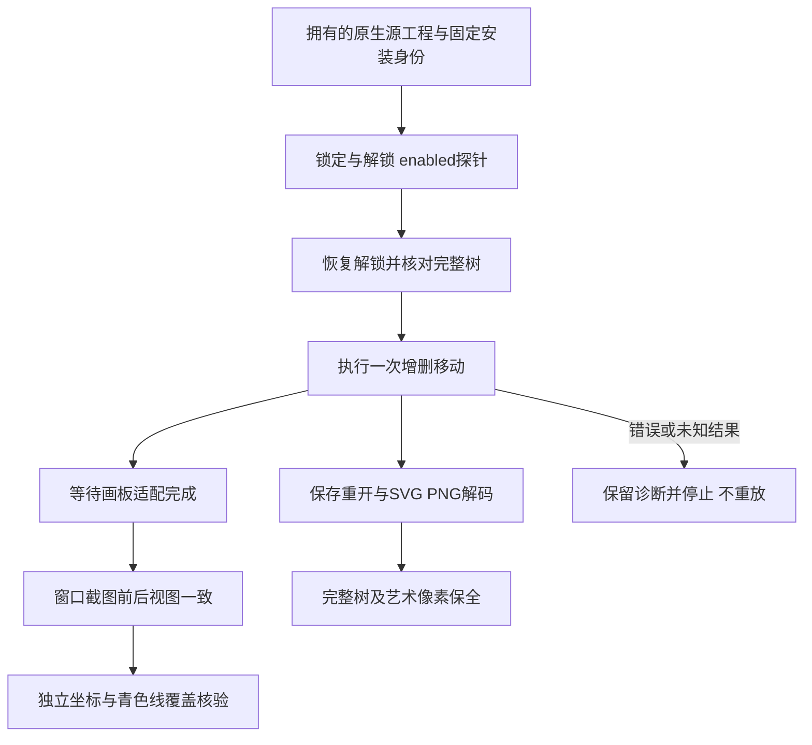

# 辅助线固定安装验收

逐命令辅助线固定安装增量：公开dev.64/source46实际安装副本完成3条guide命令、6轮原生保存重开、12份解码SVG/PNG和6张真实拥有窗口。独立列表断言核验追加索引、删除后的索引收缩与移动时方向保全，第二轮仅先修改自有控制对象名称。6组真实锁定／解锁注册表探针证明新增始终可用、锁定禁用删除／移动，完整工程保全并恢复解锁；未提交禁用编辑请求。9组图像比较确认辅助线不进入艺术导出；28项按文档坐标与缩放计算的窗口检查确认现存线及删除／移动旧线的消失。新驱动最多20次纯读取等待画板适配，截图前后视图一致；首次null返回／画布宽高假设和未适配视图失败记录保留。13安装技能身份、原控制文字、源工程及前轮交付保全。31项新增回归通过；汇总136/585通过、449 NOT_RUN、272轮保存重开、544份解码导出。8.3保持开放，121/127完成、6项开放；不提升undo、模型、秘密边界、全GUI、市场或完整V1。

[原生证据](evidence/vectorcraft-command-guide-fixed64-20261009.json)绑定驱动、运行时、固定安装技能及合成源工程。上游固定提交90e022b0c05f12171a4e9bebe0894fa62f7bc95c只提供静态语义参考，不证明二进制完全对应源码。

零旋转下，垂直线逻辑横坐标为画布x＋宽度÷2＋(线pos－视图中心x)×zoom；水平线对应y。canvasRect为[x,y,width,height]。实际窗口逻辑1440×900，本轮物理1×记录在每轮证据中；不冒称1280×1024。沿画布内部扫描±2个逻辑像素带，现存线青色覆盖至少80%，已移除线最多5%（允许与保留辅助线相交）。艺术导出的两轮像素须完全相等。

先前a1错误期待删除返回对象，但原生成功返回null；a3一次UI读回仍是初始未适配视图，随后窗口已完成适配。原记录保留；a4从新拥有会话验证了有界读取与截图视图稳定。此改动只涉及QA，不改产品或锁定技能；不提交用户媒体、项目二进制或本地缓存。旧133命令矩阵与原校验器保留。
