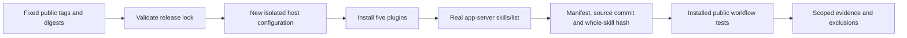

# VectorCraft Host Verification Architecture

> Date: 2026-10-05. Development snapshot: 0.1.0-dev.2. This document explains scoped technical acceptance; OpenSpec remains the sole behavioral authority.

## 1. Boundaries and ownership

The plugin owns manifest, immutable skill snapshot, documentation and release evidence. The independent skill repository owns the public install/workflow scripts. ArtCraft owns the shared host verifier and `host-acceptance.lock.json`; domain repositories consume its evidence without redefining public protocols. Host tests use a new isolated configuration and never modify the user's normal Codex installation or credentials.

## 2. Verification flow



## 3. Contracts and failure behavior

Each installed manifest digest, plugin version, skill source ref/commit and skill tree hash must match the lock. A matching skill name alone is insufficient. Invalid locks fail before creating host configuration. Existing output directories are refused. Load errors, disabled or duplicate skills, out-of-cache paths, symlinks and content drift fail verification. RPC waits are bounded; the verifier terminates its own app-server. Private cache paths and raw host state remain local; published evidence contains identities and scoped outcomes.

## 4. Evidence matrix

| Check | Codex 0.147.0 | Codex 0.153.4 |
| :--- | :--- | :--- |
| Five fixed-release installs and skill discovery | Passed | Passed |
| Installed ArtCraft first-use, revision, scheduler recovery and moved package | Passed | Passed |
| Four standalone native representative tasks | Passed | Not run separately |
| Agent model dispatch / desktop GUI | Not verified | Not verified |

ArtCraft workflows retain four native projects, update dependent outputs after Logo revision, preserve old native projects/audio, enforce revision budgets, adopt original attempts after scheduler termination and verify relocated delivery packages. Standalone tests cover the specific tasks recorded in the evidence. Derivatives retain hash-bound exchange-loss reports; counts and hashes do not prove visual fidelity or creative quality.

## 5. Repeatable verification and release gate

From the ArtCraft plugin checkout, choose an already installed Codex executable and a new output directory:

```bash
python3 -B scripts/verify_codex_host.py --codex <absolute-codex> \
  --lock <absolute-host-acceptance.lock.json> --output <absolute-new-directory>
CRAFT_HOST_TEST=1 CRAFT_CODEX_CLI=<absolute-codex> \
  python3 -B -m unittest discover -s tests -p test_codex_host.py -v
```

The online check downloads public releases. Six verifier tests passed, including content/manifest/source tampering and refusal to overwrite existing output. Native tests require the declared Python media dependencies and pinned official CLIs. `CRAFT_INSTALLED_SKILL_ROOT` selects a real installed skill cache in the independent repository's native test; imports disable bytecode writes to preserve snapshot identity.

This QA update does not alter runtime bundles, skill content or immutable tags. `marketplaceEligible` stays false and `supportedPluginHosts` stays empty until full release requirements pass. RL-001 tasks retain their unmet P0 prerequisites. See [evidence](evidence/codex-current-release.json) and [tasks](../openspec/changes/establish-v1-plugin/tasks.md).
