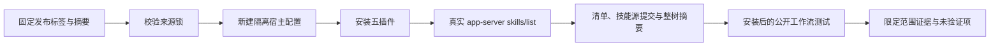

# VectorCraft 宿主验证架构

> 日期：2026-10-05。开发快照：0.1.0-dev.2。本文说明限定范围的技术验收；行为规范仍以 OpenSpec 为唯一事实源。

## 1. 边界与职责

插件负责 manifest、不可变技能快照、文档和发布证据；独立技能仓库负责安装与工作流公开脚本。共享宿主验证器和 `host-acceptance.lock.json` 由 ArtCraft 持有，领域仓消费证据，不另定义公共协议。测试创建隔离配置，不修改用户日常 Codex 安装或凭据。

## 2. 验证流程



## 3. 合同与失败语义

安装后的 manifest 摘要、插件版本、技能源 ref/commit 与整树摘要必须匹配锁文件，仅技能名称正确不足以通过。非法锁在创建配置前拒绝；已有输出目录拒绝覆盖；加载错误、禁用或重复技能、缓存外路径、符号链接及内容漂移均失败。RPC 等待有界，验证器只终止自己启动的 app-server。私有缓存路径与原始宿主记录留在本地，公开证据仅记录身份和限定范围的结果。

## 4. 证据矩阵

| 检查 | Codex 0.147.0 | Codex 0.153.4 |
| :--- | :--- | :--- |
| 五个固定版本安装与技能发现 | 通过 | 通过 |
| 安装后 ArtCraft 首次使用、修订、调度器恢复与移动验包 | 通过 | 通过 |
| 四独立领域原生代表任务 | 通过 | 未单独执行 |
| 模型自动派发 / 桌面 GUI | 未验证 | 未验证 |

ArtCraft 流程保留四种原生工程，Logo 修订更新依赖产物，旧工程与音频保持不变，限制修订预算，调度器终止后接管原 attempt，并核验移动后的交付包。独立领域测试覆盖证据所列代表任务。派生文件保留摘要绑定的交换损失报告；对象数量和摘要不能证明视觉保真或创作质量。

## 5. 可复现验证与发布门禁

在 ArtCraft 插件仓库选择已有 Codex 可执行文件与全新输出目录：

```bash
python3 -B scripts/verify_codex_host.py --codex <absolute-codex> \
  --lock <absolute-host-acceptance.lock.json> --output <absolute-new-directory>
CRAFT_HOST_TEST=1 CRAFT_CODEX_CLI=<absolute-codex> \
  python3 -B -m unittest discover -s tests -p test_codex_host.py -v
```

在线检查下载公开发布。6 项验证器测试通过，覆盖内容/清单/来源篡改和已有目录保护。原生测试依赖已声明的 Python 媒体库和固定官方 CLI。独立仓原生测试以 `CRAFT_INSTALLED_SKILL_ROOT` 选择实际宿主缓存；导入禁止写字节码以保持快照身份。

本次 QA 更新不改变运行时包、技能内容或不可变标签。完整发布需求通过前，`marketplaceEligible` 保持 false、`supportedPluginHosts` 保持空数组；RL-001 任务保留未满足的 P0 前置条件。参见[证据](evidence/codex-current-release.json)与[任务](../openspec/changes/establish-v1-plugin/tasks.md)。
