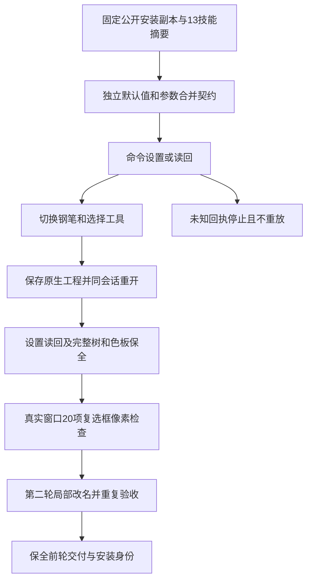

# 魔棒设置固定安装验收

逐命令魔棒设置固定安装增量：公开dev.64/source46实际安装副本完成2条magicWand命令、4轮原生保存重开、8份解码SVG/PNG及4张真实Magic Wand面板窗口。独立设置契约核验默认值、部分字段合并、重置后覆盖、未知字段忽略、颜色／描边粗细／不透明度的四种范围限制及小数保留；切换钢笔／选择工具和同会话原生重开后设置不变。第二轮先修改自有控制对象名称；完整树、色板、原控制文字、源工程、前轮交付及13安装技能身份保全。6组画布／PNG／窗口比较通过，艺术像素保全；20项独立设置导出的复选框像素断言核验五项开关。22项新增回归通过；旧138命令矩阵及校验器原字节保留，当前140/585通过、445 NOT_RUN、280轮保存重开、560份解码导出。应用重启后的偏好持久性和select.magicWand匹配仍未验收；不提升undo、模型、全GUI、创意、市场或完整V1；8.3保持开放，121/127完成、6项开放。

[原生证据](evidence/vectorcraft-command-magicWand-fixed64-20261009.json)绑定安装副本、驱动、运行时、合成工程、参数、读回和原始捕获摘要。上游固定提交仅为静态语义参考，不证明编译二进制与源码精确对应。

四张自有窗口均已目视检查，实际1440×900、1倍像素。固定布局复选框区域x851、宽高13，y为159／209／241／291／323；预期来自独立设置契约，不由实际返回生成。面板数值格式化会将12.5%显示12%、7.5显示8，原生读回保留小数。自动像素断言只覆盖复选框，不覆盖文字OCR或GUI交互。设置为会话状态；同会话重开不能替代进程重启持久性验收。本轮没有全局安装或用户素材。

