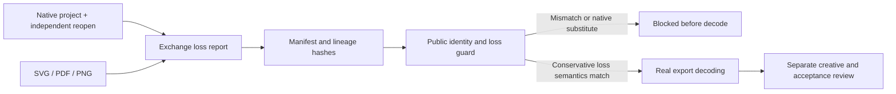

# Native project and exchange delivery

Plugin59 pins unchanged source43 skills. The actual installed58 checker accepted a PDF marked as native substitute after report, manifest and lineage hashes were renewed. The uniform guard now verifies native project and inspection hashes, exact export coverage, derivative-only roles and format-specific losses. SVG observations and live-text loss match bound native setup and actual XML; unknown font/effect fidelity cannot be promoted.

Candidates preserve independently reopened live text/freeform gradients, edit the retained original in a new revision, decode all three exports and refuse20 explicit boundary cases. Historical packages with no report retain NOT_RUN; current lineage packages missing reports refuse. Integrity/decoding never invent engineering reopen, creative or approval status. Fixed5.6 qualification remains open.

[Evidence](evidence/vectorcraft-exchange-delivery-candidate59-20261009.json).
