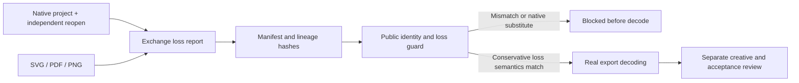

# 原生工程与交换交付

插件59锁定未变的源43技能。安装58的公开校验曾接受重签交换报告、清单及血缘后的PDF原生替代标记。统一门禁现在核验原生与检查文件摘要、完整输出覆盖、仅派生物角色及格式损失；SVG观察及文字损失与原生设置、实际XML一致，未知字体／效果保真不能被提升。

候选验证独立重开后文字／自由渐变仍可编辑，修订保留原交付，三个输出实际解码，并拒绝20类边界。完全无报告的历史包保持NOT_RUN，当前血缘包缺失报告拒绝。身份及解码校验不虚构工程重开、创作或批准状态。固定5.6验收仍开放。

[证据](evidence/vectorcraft-exchange-delivery-candidate59-20261009.json)。

公开59／源43实际安装于Codex0.153.4 macOS arm64后，通过当前VC-AR-002三个场景：原生独立重开、文字／自由渐变仍可编辑、三输出解码及20类拒绝。13项技能摘要未变，5.6关闭；115/127完成，12项开放。GUI、创作、外部编辑器保真及其他平台独立验收。 [Evidence](evidence/vectorcraft-native-exchange-fixed59-20261009.json).
