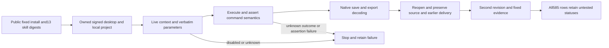
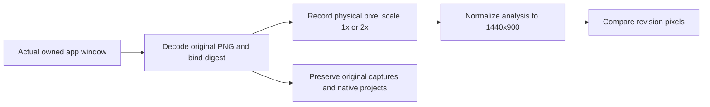
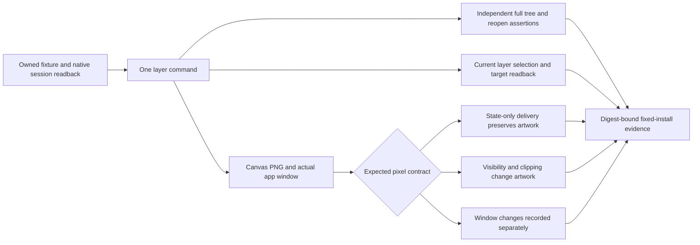
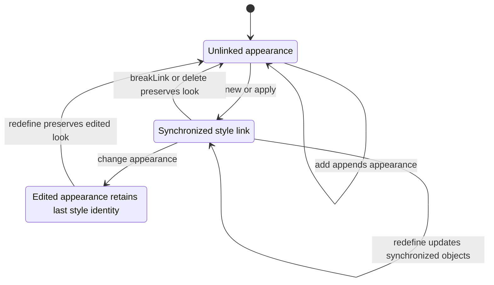

# VectorCraft optimization implementation and acceptance

This increment implements section9 and its dependencies. Plugin source is dev.43 and continues to pin published skill source dev.37. Task2.6 passed public plugin43 fixed-install scenario validation. Independent skill source is unchanged; historical candidate reports retain their execution identities.

## Implemented modules

| Repository | Module | Evidence boundary |
| :--- | :--- | :--- |
| vectorcraft-skills | Consistent strict JSON and error classification in workflow, commands and mcp_session | Red/green units; native post-save faults and reopen checks separately |
| vectorcraft-skills | Field-level brand allowlist, requested values, palette and consumers | Refuse path/text/geometry/non-target changes; native RGB cases and unit semantics for other authoring models/tints |
| vectorcraft-skills | Thirteen operation contracts, use implicit routing and explicit specialized invocation | Deterministic generation and standalone entry checks; actual host dispatch separately |
| vectorcraft-plugin | current_identity and evidence_index | Pinned versions and report/dependency digests; historical levels and NOT_RUN preserved |
| vectorcraft-plugin | SQLite Ledger and Controller | Durable intent, resource ownership, epochs, budgets, cancellation state and pinned skill execution; full failure/host acceptance remains separate |
| vectorcraft-plugin | ReviewStore, domain schemas and vector rubric | Single-round requests/receipts, stale/duplicate rejection, technical gates and scoped revision proposals |

## Local entry

Node.js24 executes TypeScript with native type stripping; no npm dependencies are installed. Python execution remains in the self-contained skill. Plugin modules do not call external models or automatically start another round.

```bash
npm test
python3 -I -B scripts/current_identity.py --check
python3 -I -B scripts/evidence_index.py --check
node src/cli.ts run STATE.sqlite REQUEST.json
node src/cli.ts review-request REVIEWS.sqlite INPUT.json
node src/cli.ts review-import REVIEWS.sqlite RECEIPT.json
node src/cli.ts revision REVIEWS.sqlite CHANGES.json
```

A run request supplies key, skill, expectedSkillSha256, plan, output, runtimeHome, estimatedBytes and authorization, plus source for a revision. Authorization records objects, fields, an absolute deadline, maxAttempts, maxBytes, optional shared budgetId, readRoots and writeRoots. Whole-skill hashing matches scripts/vendor/skill_vendor.py. Use the fixed plugin skill-lock digest, not a floating main branch.

Controller coordinates public workflow plans. Complete-command plans retain the independent commands entry. Verified files reach review_ready; unknown execution retains ownership and original files without replay. Parent exit does not prove native child termination. Cancellation confirmation and reconciliation observations require actual native inspection; API booleans are not field evidence.

## Single-round review

Requests bind source revision, runtime, editable native file, candidate previews/exports, targets and rubric digests. A target is the actual goal; judge-reference is review-only. At least one target is required. Technical PASS/FAIL/NOT_RUN remains separate from visual scores.

Domain schemas live in schemas; docs/vector-review-rubric.json defines five0–4 dimensions. Receipts name the reviewer and context origin and locate issues by object/field. Until host context evidence is verified, independent remains false; self-declarations do not establish independence. Human or current-host model review must disclose shared context and remaining uncertainty.

Revision generates a proposal after rechecking current fingerprints, valid authorization and assessed issues. It does not execute arbitrary model commands. Full budget, cancellation, plateau and restart contracts remain subject to sections3/6; storage tests do not establish a complete automatic loop.

## Release and evidence

Both repositories have local equivalents of their CI gates. Source candidate, actual GitHub CI, immutable public release, installed copy, host dispatch, GUI and model evidence remain separate. Plugin skills retain the old fixed snapshot until a published source is vendored. Generic Skills CLI, Art bundled updates, full GUI/model, exhaustive commands and V1 retain their own acceptance gates.

## Current acceptance and remaining gates

The source candidate passed129 of159 default regressions;30 conditional native/GUI tests were explicitly skipped and are not passes. Separate opt-in runs passed13 independent cold starts,10 native scene creation/revision cases,8 real consumer/non-consumer mutation faults across two entry routes,6 post-save protocol faults, and three-board/nine-export preservation. Default regression and opt-in native proof remain distinct.

The plugin passed28 Python regressions and11 Node tests. Native single-round exchange/revision used the supplied current-conversation receipt and records independent=false. Review fingerprints include exchange loss; rejection reasons persist. Controller persists plan and rechecked skill snapshots before execution and verifies cached manifests against original receipts. Calls sharing budgetId atomically consume one budget; child exit is not proof that native execution stopped.

Reproduce the bounded brand fixture with `node scripts/acceptance/single_round.ts CONFIG.json`. CONFIG supplies skill/source/runtimeHome/output/receipt/python/brief/targetColor/authorization/changes. This driver handles the Brand Primary fixture only. Scores come from the supplied receipt; it never calls a reviewer or starts another round.

Tasks9.3,9.6,9.9 and9.18 still require new immutable public releases, installed snapshots and host acceptance. Task9.21 has native single-round evidence, but full cancellation/recovery/authorization execution/plateau contracts in sections3/6 remain open. Fixed plugin skills still use source dev.33; dev.34 candidate proof does not establish an installation update. GitHub CI was not run in this increment. Nothing was committed, pushed, tagged or published.


## Managed execution increment (2026-10-08)

The source candidate checks cancellation, deadline, epoch, original project digest and accumulated output budget before each native request, and fsyncs its intent first. Native children have a file-size limit. Managed local revisions check actual object and field authorization, including every global-swatch consumer; unclassified edits fail closed. Native save timestamps are checked separately from protected document properties.

The plugin records owned PID/PGID/start-time/task identity before releasing its launch gate. Parent exit is followed by process-group observation; TERM-ignoring owned descendants may receive KILL. Cancellation retains writer occupation. Reconciliation requires actual native stop, original directory identity and file digests, plus read-only native reopen and dependency checks. It produces cancelled or interrupted_verified, never successful delivery from partial files, and quarantines receipts from an older epoch.

Use `node src/cli.ts cancel STATE.sqlite TASK.json` or `node src/cli.ts reconcile STATE.sqlite TASK.json`; TASK contains taskId and epoch. Native opt-in driver: `node scripts/acceptance/managed_cancel.ts CONFIG.json`, using the explicit single-round brand fixture configuration. The fixed dev.33 skills lack execution_control, so managed execution rejects them until the new source is published and fixed separately.

Current source regression:162 tests,132 passed,30 conditionally skipped; plugin Node regression:15 passed. Native candidate proof covers authorized revision, real saved-checkpoint cancellation, registry restart, original-file/dependency inspection and epoch fencing. Tasks3.1/3.2/3.4/3.5/3.7/3.8 are checked; complete acceptance3.3/3.6/3.9 remains open. Full task table:81 completed,46 open. This is not fixed-install, full sections3/6 or V1 acceptance.

Plugin42 adds readonly pre-migration snapshots, schema3 and explicit mode bindings; the actual previous reader rejects the new schema. See [runtime gates](Runtime-Gate.md) for bounded native evidence and the still-open complete2.6 gate. Skill source remains pinned to dev.37.

Current status (public plugin43/source37): all seven runtime scenarios and task2.6 are complete; see [runtime gates](Runtime-Gate.md). Earlier candidate/open statements describe their execution stages. The other33 tasks, full V1 and creative GUI/model gates remain open.


Public-commit installed-copy acceptance: dev.64/source46 installs from the exact remote-main commit `11a49e9d1d5f471d1c4cbf93551bdb1c87abe3d1` into an isolated Codex0.153.4 home with spaces. All13 skills load with matching identities;13 independent HTTPS empty-cache starts and12 native create/revise pairs pass,with setup-only explicitly separate and zero skips. The installed Harness passes native revision,three-format decoding,four-attempt shared-budget stop and source/text preservation;feedback scores are explicit QA fixtures. Five reference guards and161 Python regressions pass. The installer still requires the public version tag by default;candidate mode accepts only a full SHA matching remote main and records publicTagVerified=false. Original drivers are archived without re-signing old reports. This advances the install/cold-start portions of9.9/9.18;model routing,public-tag revalidation,the six-layer release gate,exhaustive command/GUI and secret boundaries remain open.121/127 tasks complete,6 open. [Evidence](evidence/vectorcraft-public-commit64-install-20261009.json).


Current installed-copy four-scenario revalidation: public-commit dev.64/source46 passes6 native revisions,15 guards and stale-proposal refusal after an owned signed desktop modifies,saves and reopens its source project. VC-QA-002 checks best candidates,round/stagnation limits,budgets and text preservation. The initial desktop fixture was correctly refused outside its owned root;placing the fixture inside that root passes without broadening product permissions. Evidence v2 derives the complete10-file checker identity from bound checker_bundle.ts;the release gate verifies the selected current report. Original v1 three-file proofs and drivers remain archived. All six development-release layers now pass;marketplace eligibility remains false. Post-publication tag installation,model routing,complete permission/secret boundaries and per-command GUI acceptance remain open:121/127 tasks complete,6 open. Scores remain explicit QA fixtures,not creative judgment. [Evidence](evidence/vectorcraft-revision-commit64-20261009.json).


Post-publication tag verification: plugin v0.1.0-dev.64 is published at6763caa1f0e6596fc01d298304794d0e9c139dc3,pinning independent source v0.1.0-dev.46. Actual public-tag installation into a fresh isolated Codex0.153.4 home discovers13 matching skills. All13 independent HTTPS empty-runtime starts and12 native create/revise pairs pass,setup-only separate,zero skips. Installed product files exactly match the pre-publication four-scenario copy;all4 main/tag CI runs pass. Thirteen completed runtime caches were removed after confirming no open handles;native projects and execution records remain. This completes the public-release/install/cold-start portion of9.18,whose9.9 model-routing prerequisite remains open;9.18 is not closed. Full permission/secret boundaries,per-command GUI,other platforms and completeV1 remain unqualified:121/127 tasks complete,6 open. [Evidence](evidence/vectorcraft-public-tag64-install-20261009.json).


Fixed-installed command increment: the actual public plugin dev.64/source46 copy passes22 paint commands,44 native save/reopen stages and88 decoded SVG/PNG exports in an owned signed desktop session. Checks bind live enabled state,verbatim parameters,target colors/gradients/freeform data,control text,source preservation and previous deliveries. Freeform splitting follows the pinned upstream Catmull-Rom curve. Initial QA assumptions about registry size,RGB readback,selection and linear positions were retained and corrected;product code was unchanged. The external complete catalog matrix records22/585 passed and563 NOT_RUN;frozen skills are unchanged. Native tool canvas images are not OS-window screenshots or creative review. Task8.3 remains open;121/127 tasks complete,6 open. [Evidence](evidence/vectorcraft-command-matrix-fixed64-20261009.json).


Fixed-installed swatch acceptance: all22 swatch commands pass44 native save/reopen stages and88 decoded SVG/PNG exports in an owned signed desktop using the actual public plugin dev.64/source46 copy. Per-command semantics cover global edits,deletion with color-preserving unlink,merge relinking,group edits/sorting/moves,Lab spot options and library save/load. Control text,source and previous deliveries are preserved;all13 installed skill digests remain unchanged. The first library-load run exposed a QA field-access error;the retained failure was corrected in the checker and the whole family revalidated,without product or skill changes. Reusing original paint22 evidence yields44/585 accepted commands,541 NOT_RUN,88 save/reopen stages and176 decoded exports;25 command-focused regressions pass. Native canvas images do not establish OS-window screenshots or creative review. Task8.3 remains open;121/127 tasks complete,6 open. [Evidence](evidence/vectorcraft-command-families-fixed64-20261009.json).





Fixed-installed stroke acceptance: all10 stroke commands pass20 native save/reopen stages and40 decoded SVG/PNG exports on actual public plugin dev.64/source46;all13 installed skill digests remain unchanged. Open paths exercise arrows,advanced profiles and width points;closed paths exercise inside/outside alignment. Assertions cover pt-to-half-width factors,arrow scale swaps,along/across profile flips,and custom profile add/delete/reset. Fill,control text,geometry,source and previous deliveries are preserved. Ten actual canvas/PNG comparisons across five style revisions show142–1189 changed pixels;43 command-focused regressions pass. Native-disabled empty reset and duplicate-profile add QA failures were retained;corrected contexts pass without product or skill changes. Profile names are qualified only within the owned private desktop session;preference persistence across app restarts remains NOT_RUN. Canvas images do not establish OS-window screenshots or creative judgment. Original44-command matrix and verifier bytes remain preserved. Current coverage is54/585,531 NOT_RUN,108 save/reopen stages and216 decoded exports. Task8.3 remains open;121/127 tasks complete,6 open. [Evidence](evidence/vectorcraft-command-families54-fixed64-20261009.json).


| Stroke input | Acceptance calculation | Protected state |
| :--- | :--- | :--- |
| Width-point left/right in pt | Native factor = 2 × side width / stroke weight | Other width points,fill and geometry |
| swapArrows and arrowScale | Swap paired endpoint arrows and scales | Color and non-stroke appearance |
| flipProfile | along: t becomes1−t and reorder;across: swap side widths | Exact point values and order |
| Custom profile names | Private-session add/delete/reset and list | No claim of preference persistence across app restarts |


Fixed-installed transparency increment: all17 transparency commands pass34 native save/reopen stages and68 decoded SVG/PNG exports on actual public dev.64/source46 in an owned signed desktop. Checks cover object opacity/blend/knockout,mask art movement and release reidentification,enable/link/options,page flags,new-mask defaults,and native edit/view state. Temporary editing layers are excluded from saved projects;mask art,control text and all13 installed skill identities are preserved. Six actual canvas/PNG comparisons across three revisions show1208–2160 changed pixels. Retained QA setup failures for invalid stroke colors,omitted false defaults and an unsaved probe document were corrected;the complete family passed in a fresh owned session without product or locked-skill changes. Defaults are qualified only within the private session;restart persistence remains NOT_RUN. Default screenshots render the artboard and do not prove greyscale mask viewing or full-window GUI. Original54-command matrix/verifier bytes remain preserved. Current coverage:71/585 passed,514 NOT_RUN,142 save/reopen stages,284 decoded exports. Task8.3 remains open;121/127 tasks complete,6 open. [Evidence](evidence/vectorcraft-command-families71-fixed64-20261009.json).


Additional owned-window evidence verifies only viewOpacityMask on/off using two1440×900 native window captures and three interior grey/colored pixel samples;editing stays active. This does not qualify all585 command GUI contexts. [Evidence](evidence/vectorcraft-mask-window-fixed64-20261009.json).


Fixed-installed shape acceptance: all10 shape commands pass20 native save/reopen stages,40 decoded SVG/PNG exports and20 actual owned app-window captures on public dev.64/source46. Independent formulas check rounded corners,ellipse/arc handles,polygon/star vertices and rotation,reversed decaying spirals,grid divider ordering,and deterministic flare subtrees/radial gradients. Each second round revises only the actual previous return-ID object's opacity and creates a differently parameterized shape;control artwork/text,other fields,source and previous delivery files are preserved. All30 canvas/PNG/window comparisons change244–165235 pixels;all13 installed skill identities remain unchanged. Original physical window scales1x/2x are recorded;window analysis explicitly normalizes to1440x900. Failed screenshot reads are retained with at most three read-only attempts;edit requests are never replayed. Retained QA field assumptions and white-on-white flare visibility were corrected;an owned dark backdrop makes the complete fresh-session family observable. Original71-command matrix and verifier bytes remain preserved. Current coverage:81/585 passed,504 NOT_RUN,162 save/reopen stages,324 decoded exports. Window evidence covers only these10 shape commands,not all-command GUI,creative/model or completeV1 acceptance. Task8.3 remains open;121/127 tasks complete,6 open. [Evidence](evidence/vectorcraft-command-families81-fixed64-20261009.json).




Fixed-installed layer acceptance:all11 layer commands pass22 native save/reopen stages,44 decoded SVG/PNG exports and22 actual owned app-window captures on public dev.64/source46. Independent full-tree assertions check insertion above the current layer,nested sublayers,deletion/current-layer fallback,fresh preorder IDs throughout duplicated subtrees,hidden/locked selection pruning,paint-order collection,immediate eligible children,clipping-path reorder/paint removal and unpainted release,and persisted paste options. Current layer,selection and target are independently read from native session state;project persistence is not claimed for session fields. Each second round first renames an owned layer;control objects,other fields,source and previous delivery remain preserved. All33 actual canvas/PNG/window comparisons pass their explicit preservation/change/measurement contracts;the four visibility/clipping canvas/PNG comparisons change964 and419 pixels. Window differences alone do not prove command semantics. All13 installed skill identities remain unchanged;22 new assertion/evidence regressions pass. Original81-command matrix and verifier bytes remain preserved. Current coverage:92/585 passed,493 NOT_RUN,184 save/reopen stages,368 decoded exports. Task8.3 remains open;121/127 tasks complete,6 open;no all-command GUI,creative/model,permission/secret,marketplace or completeV1 claim. [Evidence](evidence/vectorcraft-command-families92-fixed64-20261009.json).




Fixed-installed graphic-style acceptance:all18 graphicStyle commands pass36 native save/reopen stages,72 decoded SVG/PNG exports and36 actual owned app-window captures on public dev.64/source46. Independent full-tree assertions check unit-box gradient placement on differently sized rectangles,replace/add appearance and transparency preservation,unique names/stable IDs,delete-with-look-preserved unlinking,redefinition propagation only to still-synchronized objects,preservation/unlinking of edited objects,merge stack order,sort/move,unused/link readbacks,built-in library inventory,and owned library save/load/name-conflict numbering/reimport deduplication. Each second round first renames an owned source object;control text,other fields,source and previous delivery remain preserved. All54 canvas/PNG/window comparisons use explicit change/preservation/measurement contracts. Delete rounds start with different primed appearances,so their cross-round images are measured only;each deletion preserves its prior appearance by full-tree assertion. Window differences alone do not prove semantics. All13 installed skill identities remain unchanged;23 new assertion/evidence regressions pass. Override Character Color covers private-session preference/list readback only;application-restart persistence is NOT_RUN. Original92-command matrix and verifier bytes remain preserved. Current coverage:110/585 passed,475 NOT_RUN,220 save/reopen stages,440 decoded exports. Task8.3 remains open;121/127 tasks complete,6 open;no exhaustive GUI,creative/model,permission/secret,marketplace or completeV1 claim. [Evidence](evidence/vectorcraft-command-families110-fixed64-20261009.json).


