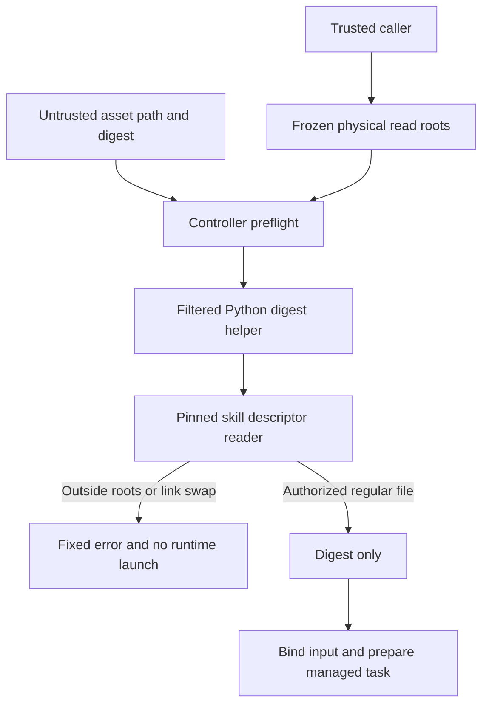

# Parent asset read boundary

An actual synthetic ancestor replacement reproduced the Node read-after-check gap. The Controller now invokes the pinned skill descriptor reader through a filtered Python helper. Frozen physical roots are passed as data and are not re-resolved as new authority. The helper returns only a digest or an allowlisted error code; no raw diagnostics or asset bytes enter the parent response. Native managed creation and inherited revision remain separate evidence from host-secret and fixed-plugin qualification.

VC-RL-002 remains partial; tasks7.4–7.6 stay open. No host-secret, full V1 or marketplace claim.
