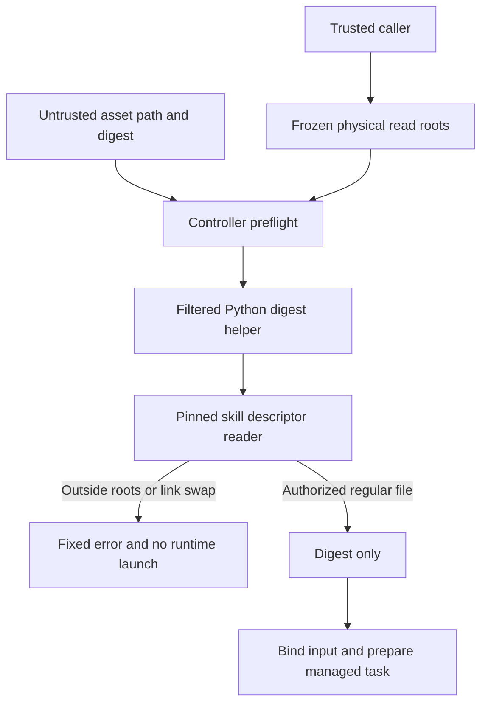

# 父进程素材读取边界

真实合成目录替换已复现Node检查后读取的缺口。Controller现通过过滤环境下的Python摘要入口调用固定技能的文件描述符读取器；已冻结物理根按数据传递，不重新解析为新的授权。仅返回摘要或允许的固定错误码，不回传原始诊断与素材内容。实际受管创建和继承返工分别记录，不替代宿主秘密和固定插件验收。

VC-RL-002 remains partial; tasks7.4–7.6 stay open. No host-secret, full V1 or marketplace claim.
