```mermaid
stateDiagram-v2
 [*] --> running
 running --> reconciling: Coordinator crash; result unknown
 running --> cancel_requested: Cancellation request
 reconciling --> reconciling: Native alive or snapshot mismatch
 cancel_requested --> cancel_requested: Native alive or snapshot mismatch
 reconciling --> interrupted_verified: Confirmed stop and original-file inspection
 cancel_requested --> cancelled: Confirmed stop and original-file inspection
 interrupted_verified --> [*]
 cancelled --> [*]
```

# Snapshot identity during interrupted recovery

Plugin dev.45 persists the control file SHA-256 in the execution intent before side effects. Before launching any native inspection process, recovery checks the complete skill digest, plan snapshot digest and control file digest. Replaced scripts, changed plans or authorization and symbolic-link snapshot files are refused. Plan and skill digests must also match the task binding. An older unresolved task without its original control digest returns recovery_identity_missing and retains resource occupation; current bytes cannot manufacture its original identity. This is a compatibility limit for old unresolved tasks; completed deliveries and pinned skills remain unchanged.

The [contract](../openspec/changes/establish-v1-plugin/specs/task-execution/spec.md) remains owned by establish-v1-plugin. Recovery reads the original files, dependencies and receipts without moving failed directories or replaying unknown edits. It never promotes interrupted files to successful delivery. Cancellation settles as cancelled; an unknown crash settles as interrupted_verified; both fence the old epoch.

Native candidate evidence covers cancellation after a real saved checkpoint, three retained-snapshot tamper refusals, coordinator SIGKILL with a surviving native group, readonly restart without replay, native reopening, handoff and quarantine of a late native reply record. SIGSTOP freezes only the registered group owned by this test; SIGKILL targets only its coordinator and verified group. Native save and reopen are real. Task3.3 closed at fixed47; complete3.6 and3.9 remain open; GUI competition, nonempty linked dependencies and the complete budget matrix require their own evidence.

Plugin48 also verifies the complete source-dependency snapshot digest. Changed, added, deleted or linked files and missing directories are refused before native inspection. Source tasks without the original snapshot digest return recovery_identity_missing and remain occupied. Six negative cases and one intact-snapshot case are added; real cancellation recovery covers skill, plan, control and source tampering.

The new post-save receipt-loss test completes real native save, nine exports and delivery digest checks, then kills its own coordinator at the ledger receipt entry. Restart finds a submitted step with no result and a stopped native group. Recovery reopens the original output readonly with its inode intact, without consuming another attempt or bytes or changing output paths. It settles interrupted_verified; the actual lost receipt is quarantined at the old epoch rather than promoting success. That run did not cover pre-native-call crashes or nonempty links; the subsequent original-stage linked-dependency acceptance is recorded below. Task3.6 stays open.

Public installed plugin48 and its actual host-loaded source37 pass the cancellation/snapshot and post-save receipt-loss cases above, with84 Node and43 Python regressions and all13 skill digests unchanged. This covers macOS arm64 and does not close3.6. [Fixed evidence](evidence/vectorcraft-source-recovery-fixed48-20261008.json).

On 2026-10-09, current external QA scripts exercised the public installed plugin48 implementation and its actual host-loaded source37 with an owned synthetic project containing one truly linked PNG. After a saved checkpoint, the coordinator and its native group stopped. Missing and modified assets both caused native links.check to reject recovery while retaining source occupation. A further asset change after a healthy inspection caused settle to refuse; restoring the original bytes and inspecting again settled interrupted_verified. Nonempty links in multiple checkpoints point inside the original failed stage; project/asset inodes, original source and event digests remain unchanged, and all owned inspection groups stopped.15 recovery regressions pass and all13 skill digests remain unchanged. QA scripts are external to the original tag48; every executed src file matches the installed tag. Pre-native-call restart and completed receipt binding matrices remain open. [Linked dependency evidence](evidence/vectorcraft-linked-recovery-fixed48-20261009.json).
