# Snapshot identity during interrupted recovery

Plugin dev.45 persists the control file SHA-256 in the execution intent before side effects. Before launching any native inspection process, recovery checks the complete skill digest, plan snapshot digest and control file digest. Replaced scripts, changed plans or authorization and symbolic-link snapshot files are refused. Plan and skill digests must also match the task binding. An older unresolved task without its original control digest returns recovery_identity_missing and retains resource occupation; current bytes cannot manufacture its original identity. This is a compatibility limit for old unresolved tasks; completed deliveries and pinned skills remain unchanged.

The [contract](../openspec/changes/establish-v1-plugin/specs/task-execution/spec.md) remains owned by establish-v1-plugin. Recovery reads the original files, dependencies and receipts without moving failed directories or replaying unknown edits. It never promotes interrupted files to successful delivery. Cancellation settles as cancelled; an unknown crash settles as interrupted_verified; both fence the old epoch.

Native candidate evidence covers cancellation after a real saved checkpoint, three retained-snapshot tamper refusals, coordinator SIGKILL with a surviving native group, readonly restart without replay, native reopening, handoff and quarantine of a late native reply record. SIGSTOP freezes only the registered group owned by this test; SIGKILL targets only its coordinator and verified group. Native save and reopen are real. Complete3.3,3.6 and3.9 remain open; GUI competition, nonempty linked dependencies and the complete budget matrix require their own evidence.

```mermaid
stateDiagram-v2
 [*] --> running
 running --> reconciling: Coordinator crash; result unknown
 running --> cancel_requested: Cancellation request
 reconciling --> reconciling: Native alive or snapshot mismatch
 cancel_requested --> cancel_requested: Native alive or snapshot mismatch
 reconciling --> interrupted_verified: Confirmed stop and original-file inspection
 cancel_requested --> cancelled: Confirmed stop and original-file inspection
 interrupted_verified --> [*]
 cancelled --> [*]
```

