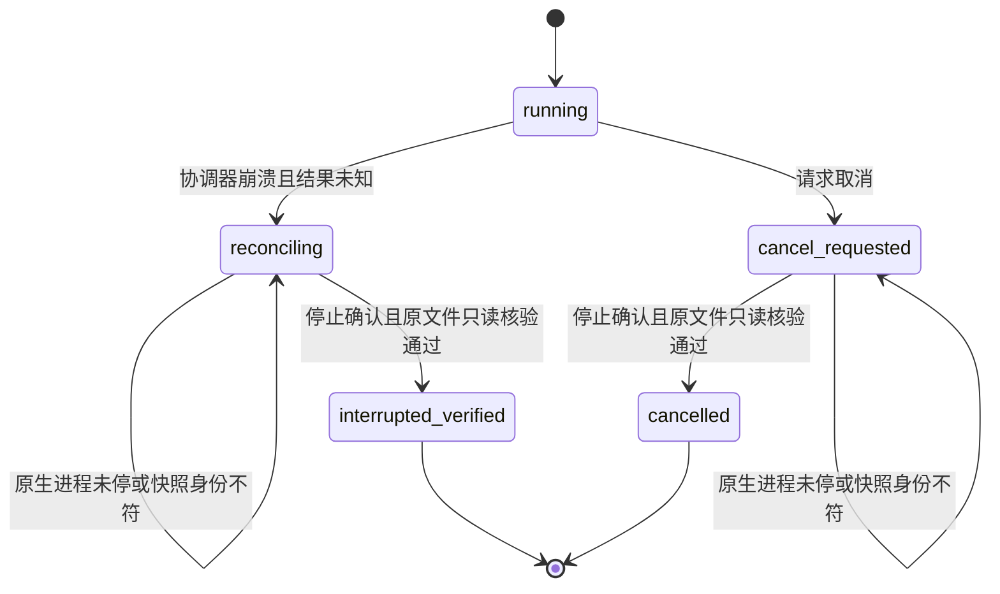

# 中断恢复的快照身份

插件 dev.45 在副作用意图中持久化控制文件 SHA-256。恢复在启动任何原生检查进程前，核对完整技能目录摘要、计划快照摘要与控制文件摘要；更换脚本、修改计划或授权、以符号链接替换快照均拒绝。计划与技能摘要同时与任务绑定核对。摘要缺失的旧任务返回 recovery_identity_missing，继续保留工程占用；不得用当前文件生成“原摘要”。这是旧未完成任务的兼容性限制，已完成交付与固定技能快照不改变。

[合同](../openspec/changes/establish-v1-plugin/specs/task-execution/spec.md)的事实源仍为 establish-v1-plugin。恢复只读取原位置工程、素材依赖和回执，不迁移失败目录，不重放未知编辑，不把中断工程提升为成功交付。取消结束为 cancelled；未知崩溃结束为 interrupted_verified；两者均推进epoch。

候选原生证据覆盖真实检查点保存后的取消、三个保留快照误改拒绝、父进程SIGKILL后存活原生组、重启无重放、原文件只读重开、交接及迟到原生回复记录隔离。SIGSTOP仅为本用例登记的原生组冻结故障现场，SIGKILL仅终止本用例的协调器和确认归属的进程组。没有模拟原生保存或用文件存在替代重开。任务3.3已由固定47关闭；完整3.6、3.9仍需各自全部场景；GUI竞争、非空链接依赖与预算矩阵不由本证据代替。

插件48同时核对源工程依赖快照的完整摘要；快照文件改动、增删、链接替换或目录丢失在原生检查前拒绝。源任务缺少原快照摘要时报告 recovery_identity_missing，保持占用。候选新增6个失败用例与1个有效快照用例；真实取消恢复同时覆盖技能、计划、控制与源快照4种误改拒绝。

新增保存后回执丢失验收：真实原生保存与9项导出、交付摘要验证均完成后，测试在账本receipt入口终止自己的协调进程。重启确认步骤仍submitted且没有result，原生组已停止；保留原输出inode并只读重开，不增加attempts或bytes，不换路径重试。结果为interrupted_verified，实际丢失回执随后按旧epoch隔离，不提升为成功交付。原生调用前崩溃与非空链接依赖的全部场景仍未验收，3.6保持开放。

公开固定插件48及其实际宿主加载的源37已通过上述取消／快照与保存后回执丢失场景，以及84项Node、43项Python回归；13技能摘要不变。仅覆盖macOS arm64，不关闭3.6。[固定证据](evidence/vectorcraft-source-recovery-fixed48-20261008.json)。
