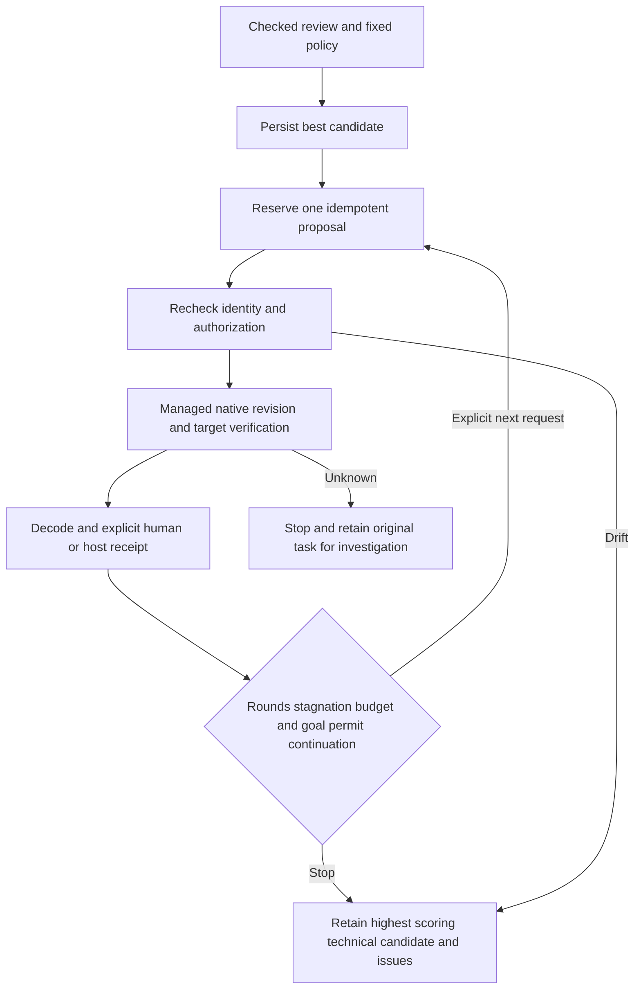

# VectorCraft bounded revision candidate

This is an unpublished plugin source candidate; published dev.39 bytes remain unchanged. OpenSpec `VC-QA-002` is the sole behavior authority. Tasks6.4/6.5 cover tests and minimal implementation; complete boundary acceptance6.6 remains open.

Explicit calls follow `revision-cycle-open` → `revision-cycle-propose` → `revision-cycle-run` → `review-checked` → human or host `review-import` → `revision-cycle-observe`. Invoke each as `node src/cli.ts ACTION DATABASE REQUEST.json`. `revision-cycle-best` reads the retained candidate after verifying its hashes. All calls share one database; no next round starts implicitly.

Open with `{"id":"cycle-1","requestId":"checked-and-reviewed-request-id","policy":{"maxRounds":3,"stagnationLimit":2,"minImprovement":0.1}}`. The immutable policy follows the [JSON Schema](../schemas/vector-revision-policy.schema.json). A checked-decoder review with technical/integrity PASS and a shared authorization budgetId is required. Another cycle cannot reset the same budget. Ranking uses the mean of five receipt dimensions. Any higher non-rejected candidate becomes best; improvements below minImprovement still count toward stagnation.

Proposal requests carry cycleId, requestId, changes and key. Each change has objectId, a native JSON field path and value. Same-key retries reuse the round; pending rounds cannot overlap. Issuing a proposal reserves one round; unknown execution stops without replay. Run requests carry cycleId, proposalId and existing Controller fields under run. The coordinator fixes source, assessed authorization, shared budget and input fingerprints. Values must match native JSON types and are checked after saving.

The pinned skills currently classify swatch.edit, paint.setFill and text.setText for managed authorization and field preservation. This increment adds no native command families. Global swatch changes must cover every actual consumer. Bound files are checked before execution, at the launch gate, during supervision and after saving. Polling does not establish atomic GUI concurrency or complete acceptance.

Observe requests carry cycleId, requestId and proposalId. They require current checked reviews bound to the executed task, original project revision, output directory, runtime and original goal. Best results report stop reason, retained hashes, latest review issues, rounds, stagnation and shared budget. Candidate copying, decoding and native execution all consume the same durable budget. Retained copies include delivery files and target/rubric/loss inputs; changing the original never overwrites the best copy.

Two actual macOS arm64 color revisions cover stagnation, round limits, original preservation, restart budgets, retained candidates and CLI reads. Scores are test-injected. Other revision families, complete GUI competition, real creative judgments and full6.6 remain unqualified. Engineering stays NOT_RUN and acceptance pending. [Candidate evidence](evidence/vectorcraft-revision-cycle-candidate-20261008.json).
