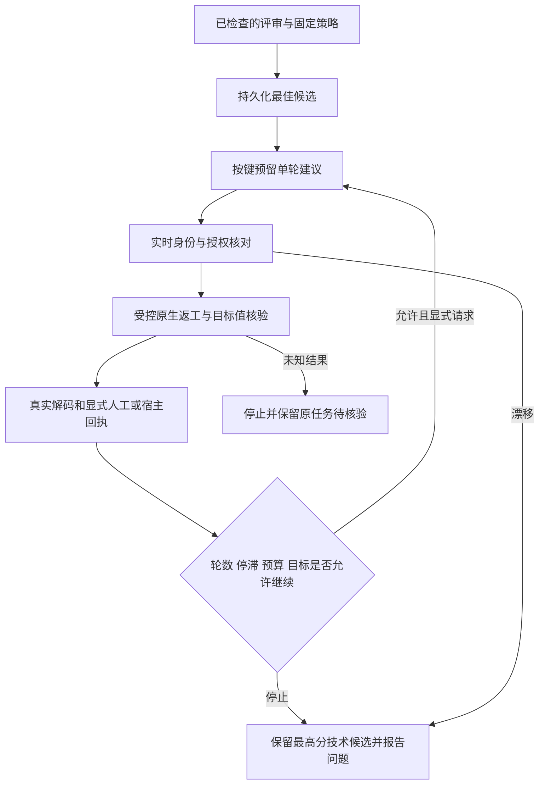

# VectorCraft 受限修订候选

当前为插件源码候选；已发布 dev.39 的字节保持不变。OpenSpec `VC-QA-002` 是唯一行为事实源，6.4／6.5覆盖测试与最小实现，6.6完整边界验收继续开放。

显式调用顺序为 `revision-cycle-open` → `revision-cycle-propose` → `revision-cycle-run` → `review-checked` → 人工或宿主 `review-import` → `revision-cycle-observe`。每个动作通过 `node src/cli.ts ACTION DATABASE REQUEST.json` 调用；可随时以 `revision-cycle-best` 读取仍可核验的最佳候选。CLI使用同一个数据库，不隐式开始下一轮。

打开请求为 `{"id":"cycle-1","requestId":"已检查并收到回执的请求ID","policy":{"maxRounds":3,"stagnationLimit":2,"minImprovement":0.1}}`。策略遵循 [JSON Schema](../schemas/vector-revision-policy.schema.json)，创建后不可改写。原评审须来自 checked-decoder，技术及清单完整性为PASS，授权须带唯一共享budgetId；同一预算不能另开循环重置轮数。五维评分取均值；更高的非拒绝候选均保留，小于minImprovement的提分不重置停滞计数。

建议请求包含cycleId、requestId、changes、key；changes为objectId、原生JSON字段路径field及目标value。相同键重试复用建议，不重复占轮；不同键不能重叠待执行轮次。轮数在发出建议时预留，执行未知时停止并保留记录，不自动重放。run请求包含cycleId、proposalId及既有Controller run字段组成的run对象；源、字段授权、共享预算和输入指纹由协调器固定，不能由run覆盖。value须与原生JSON值一致，目标值在保存后逐项核验。

固定技能目前对swatch.edit、paint.setFill、text.setText执行管理授权和字段保全；本增量没有扩展其他原生命令。全局色板修改必须覆盖所有实际消费者，缺少已评审对象或字段时原生门禁拒绝。执行前、启动门禁、执行期间轮询及保存后复核全部绑定文件；不能把轮询当作与GUI修改的原子事务或完整并发验收。

后续observe请求包含cycleId、requestId、proposalId，只有匹配执行记录、原源摘要、输出目录、运行时和原目标的当前评审才能推进。停止时best返回原因、最佳副本摘要、最新评审问题、轮数、停滞和预算。候选复制、技术检查和原生执行都消耗同一持久预算，重启不重置。副本包括交付清单及全部文件和目标／rubric／损失输入，原源修改不会覆盖该副本。

两项真实macOS arm64颜色返工覆盖停滞、轮数上限、源保全、重启预算、最佳副本和CLI读取。评分为测试注入，其他修订家族、完整GUI竞争、真实创作判断及完整6.6尚未验收；工程状态仍NOT_RUN，接受状态pending。[候选证据](evidence/vectorcraft-revision-cycle-candidate-20261008.json)。
