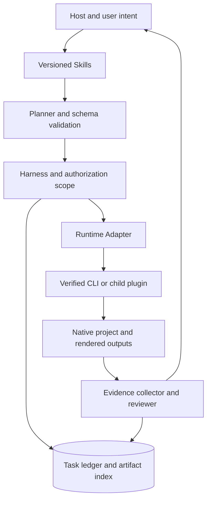
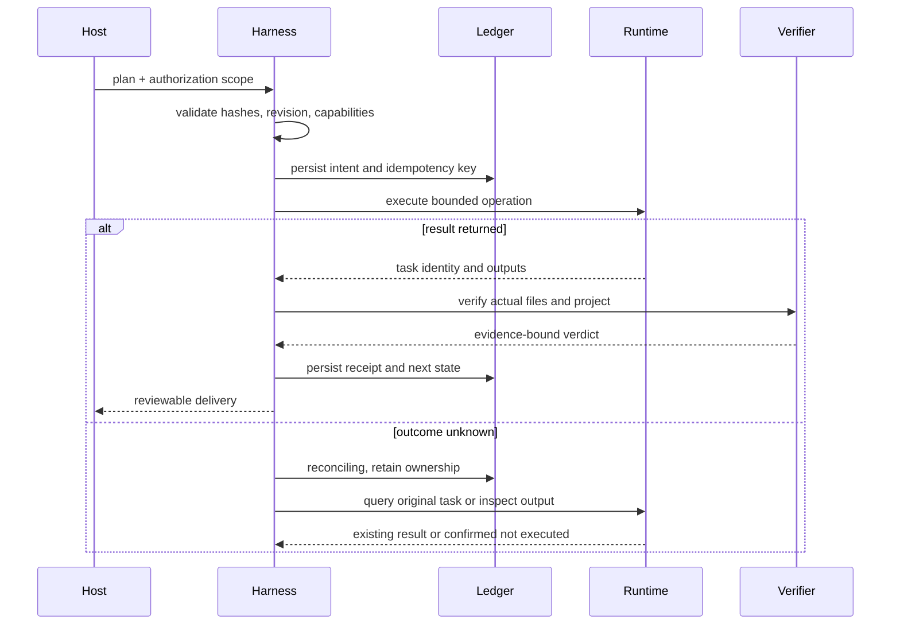
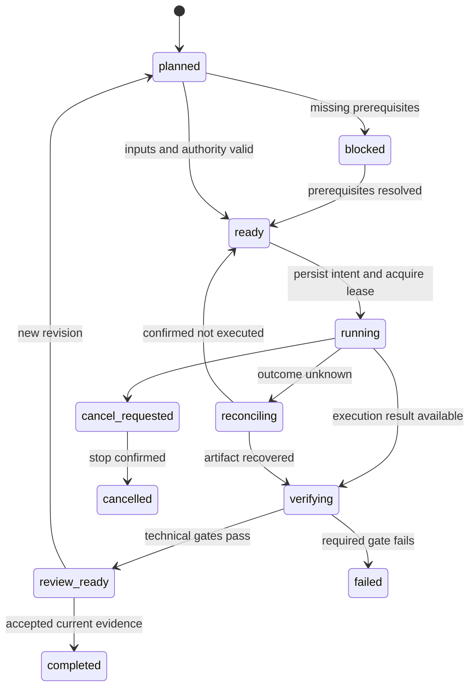

# VectorCraft Runtime Architecture

> **Purpose**: Complete target design for processes, data, protocols, recovery and acceptance.
>
> **Version**: 1.0.0
> **Updated**: 2026-10-05
> **Status**: Target design, not implemented. Observations and acceptance evidence are identified separately.

Related documents: [Brand boundary](../product-docs/VectorCraft/en/1%E3%80%81VectorCraft-Naming-and-Brand.md) · [Technical plan](../product-docs/VectorCraft/en/5%E3%80%81VectorCraft-Technical-Plan.md) · [Detailed architecture](VectorCraft-Runtime-Architecture.md) · [OpenSpec](../openspec/changes/establish-v1-plugin/proposal.md) · [Evidence](evidence/runtime-baseline.json)

## 1. Positioning and evidence boundary

VectorCraft provides editable vector brand assets and multi-artboard design. This repository currently contains documentation, specifications, metadata and sanitized runtime evidence; application source, business skills and full host integration are not implemented. Runtime components below describe the target design.

## 2. Drivers and non-goals

Preserve native editability, independent skills, recoverable execution and evidence-backed delivery. V1 uses a local workspace; SaaS, multi-tenancy, billing accounts, web administration and a new desktop editor are out of scope. Automatic lossless cross-application dynamic linking is not promised.

## 3. Components and dependency direction

| Component | Authoritative data | Must not own |
| :--- | :--- | :--- |
| Skills | Procedural knowledge, triggers and domain methods | Task state or secrets |
| Domain Harness | Domain plans, project revisions and child task ledger | Other plugins’ internal state |
| Runtime Adapter | Command mappings and capability snapshots | Changing creative goals |
| Native CLI | Native objects, edits and rendering | Cross-plugin project authority |
| ArtCraft | Brief, DAG, asset versions and aggregate delivery | Fabricating child success |

## 4. Repository and module boundaries

| Planned module | Responsibility | Input and output |
| :--- | :--- | :--- |
| src/planning/ | Normalize goals and edit plans | Brief → DomainPlan |
| src/harness/ | State machine, authorization, budget, recovery | DomainPlan → TaskReceipt |
| src/adapters/ | Upstream command and result mapping | TaskRequest → native command |
| src/artifacts/ | Register hashes, references and delivery | files → ArtifactManifest |
| src/evaluation/ | Technical checks and creative findings | artifacts → QualityVerdict |
| skills/ | Build-time locked skill snapshots | skills.lock.json → packaged knowledge |
| runtime/ | Release locks and compatibility matrix | artifact metadata → verified executable |

These are planned modules, not claims that the source exists.

## 5. Native domain boundary

| Capability | Behavioral boundary | Status |
| :--- | :--- | :--- |
| Paths, shapes and coordinates | Define artboard coordinates, units, control points, path closure and strokes; preview pixels are not vector path authority. | Planned |
| Grouping and boolean operations | Record operand IDs, boolean operation and result identity with a pre-operation checkpoint; failure must not destroy source objects. | Planned |
| Brand colors and text | Bind brand colors using explicit tokens instead of global color replacement; retain text and font dependencies and report editability loss when outlining. | Planned |
| Artboards and variants | Give each artboard a stable ID, name, size and output mapping; define preview ordering and export ranges without index-base ambiguity. | Planned |
| Interchange fidelity scope | Validate native .vectorcraft, SVG, PDF and PNG separately; report rasterized effects and keep native sources when interchange cannot preserve them. | Planned |
| Brand variant revision | Update related variants from token and asset dependencies and verify that unrelated object properties and outputs remain unchanged. | Planned |

Domain objects: `VectorDesignPlan`, `Document`, `PathObject`, `Artboard`, `BrandToken`.

## 6. Processes, sessions and concurrency

The host loads knowledge and invokes the plugin entrypoint. A local harness calls upstream through stdio MCP subprocesses or verified CLI argv. Continuous editing retains one native session; separate CLI invocations do not implicitly share memory. Each project has an exclusive write lease and epoch; reads use stable snapshots. expectedRevision detects GUI edits. ArtCraft schedules concurrently only when write resources do not overlap.

## 7. Success path and side-effect boundary

## 8. State machine and legal transitions

Late results after cancellation may be recorded as orphan artifacts but cannot change a cancelled task to completed. Unknown outcomes retain ownership until reconciled; manual reconciliation also requires evidence.

## 9. Persistence, recovery and memory

Use SQLite transactions for tasks, events, asset indexes and authorization references, with large files in content-addressed storage. Commit intent before launching side effects; stage files, verify, atomically rename, then register consumable artifacts. Reconcile or quarantine orphan files after crashes. SQLite and native applications do not form a distributed atomic transaction. Session summaries assist planning; project state, task ledgers and acceptance records remain separate authorities. Persist long-term preferences only when authorized, and never promote inferred preferences into project facts.

## 10. Interfaces and public contracts

Planned adapter operations are capabilities, validate, estimate, submit, status, cancel, reconcile, collect and verify. They are not assertions that upstream CLIs expose these command names. ArtCraft OpenSpec owns craft-task/v1 and craft-artifact/v1; domain plugins own command mappings and domain payloads. Pin cross-repository references to an integration-tested commit before release.

| Field | Semantics |
| :--- | :--- |
| idempotencyKey | Same inputs return original task; changed inputs conflict |
| expectedRevision | Protect modifications made by users or other runs |
| authorizationRef | Reference existing authority; do not demand repeated approval for covered actions |
| inputRefs | Include asset version and digest, not only a path |
| runtimeIdentity | Bind version, digest, mode and capability snapshot |
| deadline / budget | Parent and child share ceilings without double counting |

## 11. Error semantics

| Code | Trigger | Recovery |
| :--- | :--- | :--- |
| runtime_missing | No compatible runtime | Explicit setup; no unverified source build |
| capability_missing | Unsupported command, parameter or mode | Revise plan or pin a supported runtime |
| revision_conflict | Project changed | Inspect and replan without overwrite |
| outcome_unknown | Side effect outcome unknown | reconcile |
| artifact_invalid | Hash, decode or project validation failed | Retain evidence and rework target |
| budget_exhausted | Cost or revision ceiling reached | Stop new work and report state |

## 12. Configuration, permissions and input trust

Configuration precedence is authorized task parameters, project config, user config, then defaults; secrets are references only. Explicit CLI paths still require identity verification. V1 defaults to local files, separates read/write roots and rejects canonical-path escape, symlink escape and non-target overwrite. Use argv arrays rather than shell concatenation. Asset names, layer text, upstream responses and reference documents are data, not policy. Domain editing does not upload by default; cloud adapters check authorization scope and budget.

## 13. Quality and evaluation

A deterministic evaluator checks structure, hashes, dimensions, duration, audio, alpha and project reopening. A creative evaluator reads fixed references and artifacts and produces localized findings; it cannot edit directly or declare completion. Planner, executor and evaluator are logical roles and do not require multi-agent deployment. Human acceptance binds the current evidence digest. Offline fixtures cover success, missing dependencies, corrupt output, stale evidence and adversarial metadata; aesthetic reviews record model, prompt and rubric versions rather than treating one score as proof of stability.

## 14. Resource and performance targets

Unmeasured targets: at most one writer per project, one render at a time by default, and at most three creative revision rounds. Metadata requests have a 10-second deadline; render deadlines are explicit plan parameters and expiration does not prove failure. Measure speed, memory and disk use by dimensions, duration, effects and hardware; no throughput or real-time guarantee is made. Disk budgets include inputs, native projects, checkpoints, outputs and peak temporary usage; insufficient space blocks new side effects.

## 15. Installation, upgrade and rollback

Store CLI versions, licenses, digests and receipts in user-level versioned directories; plugin caches contain read-only packages. Prefer official artifacts, verify platform and digest, then atomically activate a validated staging directory. Drain active sessions before upgrade, retain the previous version and switch only after startup probes; state-schema migration requires backups and rollback compatibility checks. Standalone skills discover runtimes through public setup entrypoints. Routine tasks must not repeatedly download, upgrade or compile CLIs.

## 16. Observability and operations

Correlate logs by projectId, taskId, attemptId, runtimeIdentity, planHash and artifactHash; record transitions, queue wait, execution duration, retries and gates without credentials or private media contents. Doctor distinguishes installation, version, capability, host and native delivery. Quiesce writes for consistent ledger backup and retain an asset manifest; recompute hashes and reconcile unfinished tasks after restore. Clean only confirmed unreferenced caches, preserving projects, evidence and user inputs.

## 17. Compatibility, acceptance and evolution

Observed: official CLI 0.2.0 for the four applications starts and completes basic MCP calls on macOS arm64. Unverified: full creative workflows, host plugin installation, desktop bridges, macOS x64, Windows and Linux. Every compatibility row requires version, platform, mode and real-case evidence. V1 validates local native workflows before cross-plugin and generation-service integration.

Create logo and icon assets in .vectorcraft, SVG and PNG; change a brand color and update bound variants while preserving unrelated colors.

## 18. Handoff to ArtCraft

The domain plugin works independently without ArtCraft. ArtCraft calls the same domain execution path with parent identity, input versions and budget; collection returns public receipts only. The child executor owns execution retries while the parent queries and coordinates dependencies. Handoff checks input references, output hashes, loss reports and native projects rather than exit codes alone.

## 19. Risks and decision reversal

| Risk | Detection | Mitigation and owner |
| :--- | :--- | :--- |
| R1 | Upstream command or format changes | Runtime owner: pin releases, diff schemas and rerun fixtures; keep old version until verified |
| R2 | Text, alpha or color loss on handoff | Domain owner: retain native sources, emit loss reports and inspect pixels and objects |
| R3 | Duplicate submission after disconnect | Harness owner: persist intent and idempotency keys, reconcile before retry |
| R4 | Design documentation mistaken for implementation | Release owner: planned feature status; no marketplace entry without working skills and runtime |
| R5 | ArtCraft branding and restricted-source boundaries | Maintainer: independent implementation; do not copy ArtCraft/Services source; clear branding before distribution |

If real concurrency or multi-machine needs exceed the local ledger, evaluate service deployment through a new OpenSpec change. If upstream commands remain unavailable, narrow the declared scope or add an explicitly tested adapter rather than silently changing native-delivery requirements.

---

**Document version**: 1.0.0
**Created**: 2026-10-05
**Updated**: 2026-10-05
**Document status**: Ready for review; implementation status is governed by OpenSpec tasks and evidence.

Current implementation: native deliveries include exchange-loss.json. The public workflow retains native source and reopened inspection digests and records format losses, observed SVG/PSD structure and unknown font/effect fidelity. Reports are part of manifest.files and are rechecked during ArtCraft adoption and packaging. Full interchange fidelity acceptance remains open.

## Current host acceptance

Snapshot `0.1.0-dev.2` has scoped installation/discovery and installed-entrypoint evidence. See [verification contracts and exclusions](VectorCraft-Host-Verification-Architecture.md). Full release tasks remain open; target design sections do not constitute implementation evidence.

## CLI skill suite revision

[VectorCraft CLI / setup / task suite](VectorCraft-Skill-Suite-Architecture.md)

## Default-first-use capability gate implementation

Controller now validates the pinned skill plan, installs a verified version directory and probes live schemas before selecting a runtime and recording editing intent. The fixed skill command signatures and plugin MCP tool schemas constrain execution. Different selections are not implicitly upgraded; same-version concurrent tasks reuse selection with transactional identity/mode checks. Original keys inspect receipts without replay; legacy ready records without capability fingerprints require reconciliation. See [entry points and candidate evidence](Runtime-Gate.md). Task2.6 different-version and desktop/migration acceptance remains open.
