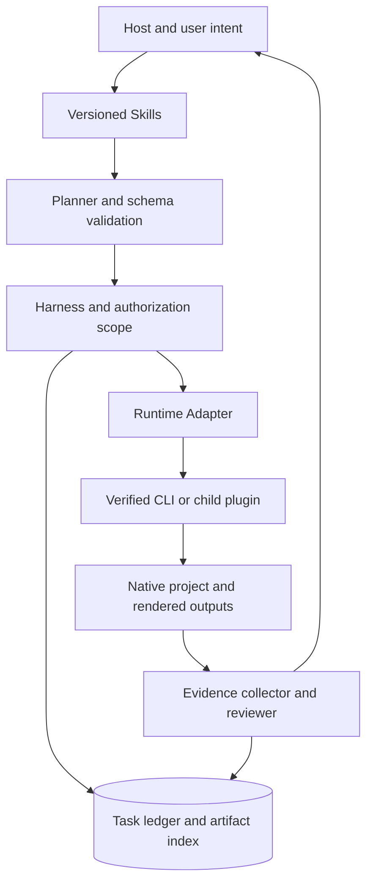
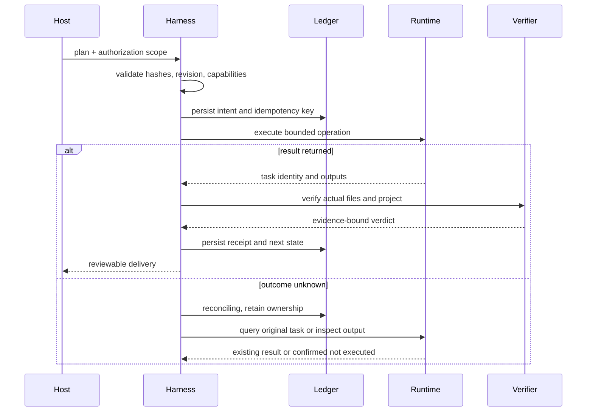
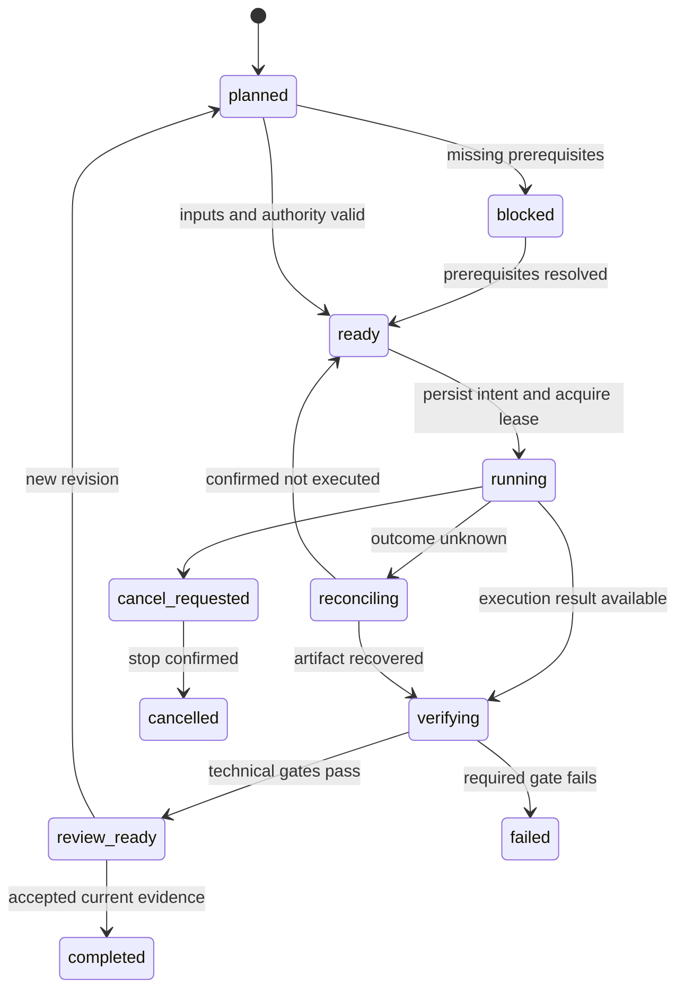

# VectorCraft Runtime Architecture

> **文档说明**：进程、数据、协议、故障恢复及验收的完整目标设计。
>
> **版本**：1.0.0
> **最后更新**：2026-10-05
> **状态**：目标设计；尚未实现。事实依据与验收结果单独标注。

关联文档：[品牌边界](../product-docs/VectorCraft/1%E3%80%81VectorCraft-%E5%91%BD%E5%90%8D%E4%B8%8E%E5%93%81%E7%89%8C%E8%AF%B4%E6%98%8E.md) · [技术方案](../product-docs/VectorCraft/5%E3%80%81VectorCraft-%E6%8A%80%E6%9C%AF%E6%96%B9%E6%A1%88%E4%B8%8E%E8%B7%AF%E7%BA%BF.md) · [详细架构](VectorCraft-Runtime-Architecture.zh_CN.md) · [OpenSpec](../openspec/changes/establish-v1-plugin/proposal.md) · [证据](evidence/runtime-baseline.json)

## 1. 定位与证据边界

VectorCraft 负责可编辑矢量品牌资产与多画板设计。当前仓库包含文档、规格、元数据与脱敏运行时证据；`src/`、业务技能和完整宿主适配尚未实现。所有下列运行时组件均为目标设计。

## 2. 驱动与非目标

必须保留原生可编辑工程、独立技能分发、可恢复执行和可证实交付。V1 使用本地工作区；不建设 SaaS、多租户、账户计费、Web 管理台或新的桌面编辑器。不承诺自动跨软件无损动态链接。

## 3. 组件与依赖方向

| 组件 | 权威数据 | 禁止承担 |
| :--- | :--- | :--- |
| Skills | 操作知识、触发条件、领域方法 | 任务状态和秘密 |
| Domain Harness | 领域计划、工程修订、子任务账本 | 其他插件内部状态 |
| Runtime Adapter | 命令映射与能力快照 | 自行改变创作目标 |
| Native CLI | 原生对象、编辑与渲染 | 跨插件项目真相 |
| ArtCraft | Brief、DAG、资产版本与聚合交付 | 伪造子任务成功 |

## 4. 仓库与模块边界

| 规划模块 | 责任 | 输入与输出 |
| :--- | :--- | :--- |
| src/planning/ | 规范化目标与编辑计划 | Brief → DomainPlan |
| src/harness/ | 状态机、授权、预算、恢复 | DomainPlan → TaskReceipt |
| src/adapters/ | 上游命令与结果映射 | TaskRequest → native command |
| src/artifacts/ | 登记哈希、引用与交付 | files → ArtifactManifest |
| src/evaluation/ | 技术检查与创作问题 | artifacts → QualityVerdict |
| skills/ | 构建时锁定同步的技能 | skills.lock.json → packaged knowledge |
| runtime/ | 发行锁文件与兼容矩阵 | artifact metadata → verified executable |

以上路径为拟建模块，不代表源码已存在。

## 5. 原生领域边界

| 能力 | 行为边界 | 状态 |
| :--- | :--- | :--- |
| 路径形状与坐标 | 定义画板坐标、单位、路径控制点、闭合性与描边；不可把预览像素当成路径事实。 | 计划中 |
| 组合与布尔操作 | 记录参与对象 ID、布尔运算与结果对象身份，保留修改前检查点；操作失败不丢失原对象。 | 计划中 |
| 品牌色与文字 | 以显式 token 绑定品牌色而非全文件颜色替换；保留文本内容与字体依赖，轮廓化输出记录可编辑性损失。 | 计划中 |
| 画板与变体 | 每个画板有稳定 ID、名称、尺寸和输出映射；预览顺序与导出范围明确，避免索引基准混淆。 | 计划中 |
| 交换格式能力范围 | 原生 .vectorcraft 与 SVG、PDF、PNG 分别验证；遇到不可交换效果时报告栅格化范围并保留原工程。 | 计划中 |
| 品牌变体更新 | 根据 token 与素材依赖更新相关变体，核对无关对象属性与输出没有变化。 | 计划中 |

领域对象：`VectorDesignPlan`, `Document`, `PathObject`, `Artboard`, `BrandToken`.

## 6. 进程、会话与并发

宿主加载知识并调用插件入口；Harness 在本地进程中运行，通过 stdio MCP 子进程或已验证 CLI argv 调用上游。需要连续编辑时维持同一原生会话；一次 CLI 命令结束不意味着下一命令拥有相同内存状态。每个工程持有独占写入租约与 epoch；读操作只读取稳定快照。用户 GUI 修改通过 expectedRevision 校验发现。ArtCraft 只并行调度没有共同写入资源的节点。

## 7. 成功路径与副作用边界

## 8. 状态机与合法转换

取消后迟到结果可登记为孤立产物，不得恢复已取消任务为完成。未知结果不通过释放租约假装失败；人工核对也需留下证据。

## 9. 持久化、恢复与记忆

目标采用 SQLite 事务记录任务、事件、资产索引与授权引用；大文件存于内容哈希目录。副作用意图提交后才能启动进程；文件先写暂存，核验后原子更名，再登记可消费产物。崩溃后的孤立文件通过 reconcile 登记或隔离。不能宣称 SQLite 与原生应用具有分布式原子事务。会话摘要只辅助规划；工程状态、任务账本和验收记录分别是权威来源。长期用户偏好仅按授权保存，不把推断写成项目事实。

## 10. 接口与公共契约

插件适配接口为 capabilities、validate、estimate、submit、status、cancel、reconcile、collect、verify。它们是拟建公共接口，不是上游 CLI 同名命令。ArtCraft 的 OpenSpec 拥有 craft-task/v1 与 craft-artifact/v1；领域插件只定义命令映射与领域 payload。交付前应将跨仓引用固定到经过联调的提交。

| Field | 语义 |
| :--- | :--- |
| idempotencyKey | 同输入返回原任务；不同输入冲突 |
| expectedRevision | 保护用户或其他运行造成的修改 |
| authorizationRef | 引用已有授权范围；不要求每次重新确认 |
| inputRefs | 包含资产版本与摘要，不只有路径 |
| runtimeIdentity | 绑定运行时版本、摘要、模式和能力快照 |
| deadline / budget | 父子任务共享上限，不重复计账 |

## 11. 错误语义

| Code | 何时出现 | 恢复动作 |
| :--- | :--- | :--- |
| runtime_missing | 没有兼容运行时 | 执行显式 setup；不自动编译来源不明代码 |
| capability_missing | 命令、参数或模式未支持 | 修订计划或固定受支持版本 |
| revision_conflict | 工程已被修改 | 重新检查与规划，不覆盖 |
| outcome_unknown | 副作用结果未知 | reconcile |
| artifact_invalid | 产物哈希、解码或工程检查失败 | 保留失败证据，局部返工 |
| budget_exhausted | 达到成本或修订上限 | 停止新增工作并交付状态 |

## 12. 配置、权限与输入信任

配置优先级：已授权任务参数 → 项目配置 → 用户配置 → 默认值；秘密只传引用。显式 CLI 路径仍需校验身份。V1 默认本地文件，读写根目录独立，解析真实路径后拒绝越界、符号链接逃逸和覆盖非目标文件。执行 argv 数组而非拼接 shell。素材名、图层文字、上游返回与参考文档都是数据，不能修改执行策略。专业编辑默认不上传素材，云端调用由适配器检查授权范围与预算。

## 13. 质量与评估

技术评估器执行确定性检查：结构、哈希、尺寸、时长、音轨、alpha 与工程重开。创作评估器读取固定参考与产物，只产生带位置的缺陷建议，无权直接编辑或把任务标为完成。Planner/Executor/Evaluator 为逻辑职责，可在单宿主内实现，不强制多 Agent 运行。人工接受绑定当前证据摘要。固定离线 fixture 覆盖成功、缺失依赖、损坏输出、旧版本证据与对抗元数据；审美评价记录模型、提示词与量表版本，不能用单次评分证明稳定。

## 14. 资源与性能目标

以下是待测目标：每工程最大并发写入数 1；每项目默认同时渲染 1 个节点；创作修订默认最多 3 轮。metadata 请求截止时间 10 秒，渲染截止时间按计划显式设置，超时不等于失败。渲染速度、内存和磁盘需求必须按尺寸、时长、效果与硬件测量；本阶段没有吞吐或实时性能承诺。磁盘预算覆盖输入、源工程、检查点、输出与最大临时峰值；空间不足时在副作用前阻止新任务。

## 15. 安装、升级与回退

用户级版本目录保存 CLI、许可、摘要与回执，插件缓存只保存只读包。优先使用官方制品，安装前检查平台与摘要，在暂存目录验证后原子激活。升级时等待活动会话排空，保留旧版本，启动探测通过才切换；状态 schema 迁移需备份与回退兼容性检查。独立技能也能通过公开安装入口发现运行时。禁止在每次普通任务中重新下载、升级或编译 CLI。

## 16. 可观测性与运维

日志以 projectId、taskId、attemptId、runtimeIdentity、planHash、artifactHash 关联，记录状态变更、队列等待、执行时长、重试和验收门禁；不记录凭据或完整隐私素材。doctor 区分安装、版本、能力、宿主、原生交付五个层面。备份先停止写入并保存账本一致性快照，同时记录资产清单；恢复后重算哈希并核对未终结任务。清理只处理已确认无引用的缓存，工程、证据与用户素材保留。

## 17. 兼容、验收与演进

已观察：macOS arm64 上四款官方 CLI 0.2.0 能启动并完成基础 MCP 调用。未验证：完整创作流程、宿主插件安装、桌面桥接、macOS x64、Windows、Linux。兼容矩阵每行对应版本、平台、模式和真实用例证据。V1 先验收本地原生链路，后增加跨插件与生成服务。

制作 Logo 与图标资产，交付 .vectorcraft、SVG 和 PNG；修改品牌色后更新所有绑定的变体，并保留无关颜色。

## 18. 与 ArtCraft 的交接

专业插件可独立使用，无需启动 ArtCraft。被 ArtCraft 调用时沿用同一领域执行路径，传入父任务身份、输入版本与预算；产物收集后只返回公开回执。重试责任由子执行器负责，父级负责查询与依赖协调。交接成功需核对输入引用、输出摘要、损失报告和原生工程，而不是只看 exit code。

## 19. 风险与决策反转条件

| 风险 | 发现方式 | 处理与责任人 |
| :--- | :--- | :--- |
| R1 | 上游命令或格式变化 | Runtime owner：固定版本，比较 schema，重跑 fixture；未通过保持旧版 |
| R2 | 文字、透明或颜色交接损失 | Domain owner：保存源工程，生成 loss report，使用像素与对象检查 |
| R3 | 断线导致重复提交 | Harness owner：持久化意图与幂等键，先 reconcile，再决定重试 |
| R4 | 文档被误读为已实现 | Release owner：功能状态为 planned；无技能和运行时入口不得进市场 |
| R5 | ArtCraft 商标和受限许可代码边界 | Maintainer：独立实现；不复制上游 ArtCraft/Services 代码；品牌授权在发行前核对 |

如果真实并行或跨机器需求超过本地账本能力，再通过新 OpenSpec 变更评估服务化；如果上游命令长期缺失，则缩减明确能力范围或新增受验收的适配，不悄悄改写原生交付要求。

---

**文档版本**：1.0.0
**创建日期**：2026-10-05
**最后更新**：2026-10-05
**文档状态**：待评审；实现以 OpenSpec 任务和证据为准。

当前实现：原生交付包含 exchange-loss.json，公开工作流保留原生源与重开检查摘要，记录格式损失、SVG/PSD 实际结构观察及未知字体/效果保真。报告进入 manifest.files，由 ArtCraft 接管与打包时重新核验；完整交换保真验收仍待完成。

## 当前宿主验收

快照 `0.1.0-dev.2` 已有安装、发现及安装后公开入口的限定范围证据。参见[验证合同与未验证范围](VectorCraft-Host-Verification-Architecture.zh_CN.md)。完整发布任务仍保持未完成，目标设计段落不作为实现证明。

## CLI 技能体系增量

[VectorCraft CLI / setup / task suite](VectorCraft-Skill-Suite-Architecture.zh_CN.md)

## 默认首用能力门禁实现增量

Controller新任务现已先进行固定技能计划验证、可信版本目录安装与只读schema探测，再初始化同账本选择并登记编辑意图。固定技能命令签名及插件固定MCP工具schema共同约束运行时；已有不同选择不被隐式升级。同版本并发首用允许复用选择，选择竞争由SQLite事务及登记时摘要／模式校验拒绝。原任务读取不重放探测或编辑，旧ready记录无能力指纹时需恢复核验。见[入口与候选证据](Runtime-Gate.zh-CN.md)；2.6不同版本及desktop／迁移仍开放。
