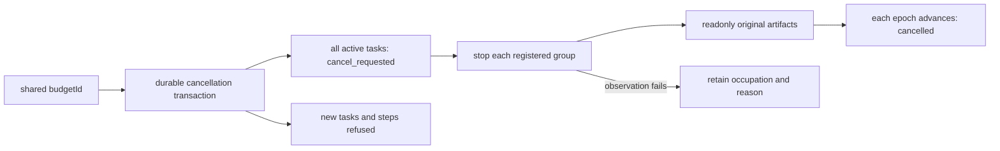

# Shared workflow cancellation and budgets

An explicit budgetId identifies one parent workflow's budget and cancellation lifetime; independent workflows use distinct IDs. One member cancellation records budget_cancellations and marks every ready/running/reconciling member cancel_requested in a transaction. Database triggers reject new tasks and steps, including stale connections. Reviewed/completed members and other budgets remain unchanged.

Controller commits cancellation before publishing control state and requesting each registered group stop. An observation or stop failure retains that member's occupation and reason without skipping other groups. Recovery verifies the original files/dependencies and stopped groups independently before advancing each epoch. Actual completed delivery receipts arriving after cancellation are quarantined in the same epoch; another arrival at the old epoch is recorded separately, never promoted to success.

All members use the same policy and deadline. Expired resumes cancel the workflow. Consumed attempts and reserved output bytes survive restart, and exhausted budgets refuse new admission. Controller owns step accounting; the source SDK does not replay edits. Reservations are not filesystem hard quotas or remote credits. The schema3 table and triggers are additive and never reset previous budgets.

Five actual candidate cases cover two surviving native groups plus a ready task, expired restart, a late real nine-export receipt, attempt exhaustion and reserved-byte exhaustion. Actual fixed installation is a separate gate.

