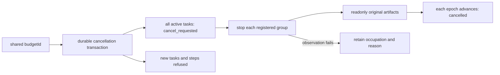

# 共享工作流取消与预算

显式budgetId代表同一父工作流的预算与取消生命周期；独立工作流使用不同ID。任一成员取消时，SQLite事务保存budget_cancellations并将所有ready／running／reconciling成员设为cancel_requested。新任务与新步骤由数据库触发器拒绝，旧连接不能绕过。已review_ready／completed成员不改写，其他预算保持独立。

Controller先持久取消，再逐个公布控制状态并请求停止登记进程组。一个组观察或停止失败，不跳过其他组；失败成员保留取消状态和占用。协调器退出后仍通过登记的原生身份停止进程，逐个只读核验原位置工程与依赖，最后推进epoch；真实迟到交付回执在同epoch隔离，旧epoch再次到达时保存到late_receipts，不提升成功。

所有成员使用同一policy，不能延长截止时间。原任务到期恢复先取消共享工作流。已消耗次数和预留输出字节保持，耗尽的预算在新任务登记前拒绝；一次原生执行只由Controller登记步骤额度，源SDK不重试编辑。预留额度不是文件系统硬配额，也不代表远端积分。schema3增加兼容表和触发器，已有预算不重置。

候选五组真实验收分别覆盖两个存活原生组加ready成员、到期后重启、真实九份导出后的迟到回执、独立次数上限与预留字节上限；固定安装门禁单独执行，不由候选替代。

