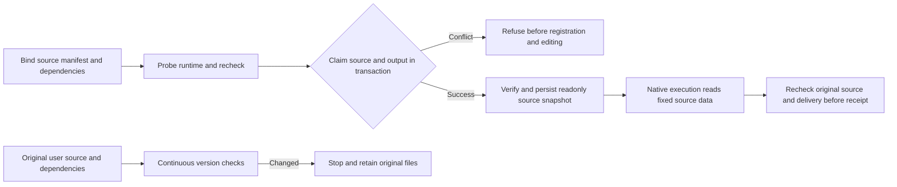

# Source input snapshots and output occupation

Plugin dev.47 additionally rechecks the captured physical roots and request paths after probing, at launch and during supervision. Replacing a resolved root or parent directory with a redirecting link is refused before registration. Fixed46 evidence is retained as a subset. Full3.3 is verified at public installed plugin47/source37 on macOS arm64. [Complete fixed matrix](evidence/vectorcraft-single-writer-fixed47-20261008.json).

Plugin dev.46 binds the source manifest, declared files and optional plan/PDF-date digests or absence before runtime probing. Traversal, linked files or parent directories and digest mismatches are refused before editing. A null-prototype dependency map prevents special filenames bypassing checks. Original inputs are rechecked after probing and during supervision. Execution reads a task-owned readonly source snapshot with every copied file checked against its captured digest, so transient source mutations cannot redirect execution data. Existing plan, skill and control snapshot identity gates remain.

Resource occupation stays on the original user project. A task-owned execution snapshot cannot create another writer identity for that project. Independent copies of an immutable delivery have separate document resource identities while retaining the same source digest. Pinned source dev.37 performs native saving, reopening and exports; all13 skills remain unchanged.

Within BEGIN IMMEDIATE, the ledger checks both the source resource and canonical destination. Different sources cannot register the same unresolved output. An SQLite insert trigger also guards old connections. Refusal creates no task, budget or editing process. The added guard neither deletes old rows nor automatically resolves historical conflicts.

Real task_contract.ts acceptance covers independent native branches, existing-output/symlink protection, staging authorization, caller alias and scope mutation after a real default probe, source metadata changes, and a signed desktop bridge saving a changed source before an old plan is refused. Native save advances metadata.modified; reopen compares all persistent content strictly except that timestamp and checks that timestamp advances monotonically. task_crash.ts covers a saved checkpoint followed by coordinator SIGKILL, surviving native processes, readonly restart without replay, competing source and output requests, confirmed stop, original-file inspection, handoff and stale native reply quarantine. Desktop bridge evidence is real GUI document state mutation, not manual human interaction or creative review acceptance.

Public installed plugin46/source37 passed the recorded native cases on macOS arm64. Root replacement was unverified at that version; current task3.3 is verified at fixed47. [Fixed-install subset](evidence/vectorcraft-single-writer-fixed46-20261008.json). Tasks3.6,3.9 and the remaining V1 requirements retain their separate gates.

