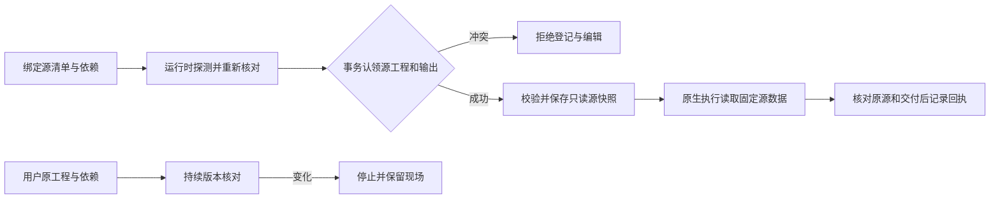

# 源输入快照与输出占用

插件dev.47进一步在探测后、启动时与监督期间复核已解析物理根目录和请求路径；将原根或父目录替换为重定向链接时，在登记前拒绝。固定46仅保留为子集证据；完整3.3已通过公开插件47及技能源37在macOS arm64的逐场景验收。[完整固定矩阵](evidence/vectorcraft-single-writer-fixed47-20261008.json)。

插件dev.46在运行时探测前绑定源manifest.json、声明文件及可选plan.json／pdf-export-date.json的摘要或缺失状态。目录逃逸、文件和父目录符号链接、摘要不符在编辑前拒绝。输入文件名不通过普通对象原型赋值保存，避免特殊名称绕过核对。探测及监督期间重新核对原源输入；执行读取任务专属、逐文件校验和只读保存的源快照，防止已绑定数据被暂时改写后读取。计划、技能与控制快照的既有身份门禁继续生效。

单写资源始终是用户原工程；源快照不变成独立资源来绕过原工程占用。同一不可变交付复制出的独立文档分支具有不同资源身份并保留相同源摘要。原生工程保存、重开和导出均由固定技能源dev.37执行，13个技能快照未修改。

账本在BEGIN IMMEDIATE事务内分别检查源工程和规范化输出；不同源也不能登记同一未终结输出。SQLite插入触发器阻止旧连接绕过输出占用，拒绝前不新增任务、预算或编辑进程。增加门禁不删除历史记录，不把旧冲突记录自动当成已恢复。

真实验收由task_contract.ts覆盖原生独立分支、现有输出／符号链接保护、暂存授权、实际默认探测后的授权别名修改、源元数据变化，以及签名桌面bridge实际修改并保存源工程后拒绝旧计划。桌面保存会推进metadata.modified；重开严格比较除该保存时间戳外的全部持久内容，并核对时间戳单调推进。task_crash.ts覆盖真实保存检查点后协调器SIGKILL、仍存活原生组、只读重启无重放、两种竞争者、确认停止后原文件核验、交接及旧epoch原生回复隔离。此GUI证据为真实桌面bridge驱动的工程状态变化，不宣称人工操作或创作评审通过。

公开插件46／技能源37在macOS arm64通过已记录原生案例，但该版本根目录替换授权边界尚未完成；当前3.3以固定47完整验收为准。[固定安装子集](evidence/vectorcraft-single-writer-fixed46-20261008.json)。3.6／3.9与其余V1任务继续各自验收。

