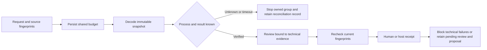

# VectorCraft checked technical review

Run `node src/cli.ts review-checked DATABASE REQUEST.json` with the existing review identity, native file, candidates, targets, rubric, exchange loss and authorization fields. Authorization additionally requires `readRoots` and `writeRoots`. Candidates must be exports declared by `manifest.json` beside the native project. `.technical-checks/` under the database directory retains readonly snapshots and reports within an authorized write root. The environment needs Python 3, Pillow and PyMuPDF; missing decoders remain NOT_RUN.

Shared budgets persist before copying or spawning, reserving snapshot bytes plus a1 MiB report limit. Timeout stops only the identified owned process group. Identical requests reuse durable records and budgets; unknown results return reconcile_required and retain records for manual investigation. Automatic recovery replay is not implemented. Completion and receipt import recheck all declared files, brief, rubric, exchange loss and checker fingerprints.

FAIL yields technical_failed/blocked; NOT_RUN yields technical_pending/pending. Native reopening remains NOT_RUN, so healthy decoding and a visual accept still leave acceptance pending. Legacy `review-request` remains caller_unverified and cannot inject checked-decoder evidence. Reviewer independence needs host evidence. `revision` returns authorized proposals without executing another round.

Task6.1 has five checker tests. Minimal integration6.2 has four additional tests and four durable healthy/corrupt checks across two routes, using copies of exports previously generated by fixed38/source35. High-score receipts are injected test data, not real creative judgment. This run did not regenerate native projects. Complete engineering/creative acceptance6.3 and bounded-round/stagnation/best-version contracts remain open. [Integration evidence](evidence/vectorcraft-checked-review-candidate-20261008.json); [prior standalone checker evidence](evidence/vectorcraft-technical-quality-candidate-20261008.json).

Public-commit installed-copy acceptance: dev.64/source46 installs from the exact remote-main commit `11a49e9d1d5f471d1c4cbf93551bdb1c87abe3d1` into an isolated Codex0.153.4 home with spaces. All13 skills load with matching identities;13 independent HTTPS empty-cache starts and12 native create/revise pairs pass,with setup-only explicitly separate and zero skips. The installed Harness passes native revision,three-format decoding,four-attempt shared-budget stop and source/text preservation;feedback scores are explicit QA fixtures. Five reference guards and161 Python regressions pass. The installer still requires the public version tag by default;candidate mode accepts only a full SHA matching remote main and records publicTagVerified=false. Original drivers are archived without re-signing old reports. This advances the install/cold-start portions of9.9/9.18;model routing,public-tag revalidation,the six-layer release gate,exhaustive command/GUI and secret boundaries remain open.121/127 tasks complete,6 open. [Evidence](evidence/vectorcraft-public-commit64-install-20261009.json).
