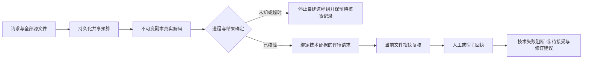

# VectorCraft 技术评审接入

`node src/cli.ts review-checked DATABASE REQUEST.json` 读取与旧评审请求相同的身份、原生工程、候选、目标、rubric、交换损失和授权字段。授权还须包含 `readRoots`、`writeRoots`；候选必须属于同目录 `manifest.json` 声明的导出。数据库目录下 `.technical-checks/` 保存只读副本和结果，须位于允许写入的根目录。运行环境使用 Python 3、Pillow 和 PyMuPDF；缺少解码器时返回 NOT_RUN。

共享预算在复制与启动进程前持久化，字节预留包含副本和1 MiB报告上限；超时停止已确认身份的自建进程组。相同请求复用记录，不重置预算；未知结果返回 reconcile_required，保留记录供人工核验，尚无自动恢复重放。检查完成及回执导入时重新核对全部清单文件、brief、rubric、交换损失和检查器摘要。

技术失败返回 technical_failed／blocked；未执行返回 technical_pending／pending。工程重开仍为 NOT_RUN，健康解码加视觉接受也只能 pending。旧 `review-request` 兼容但标记 caller_unverified，不能注入 checked-decoder 证据；回执独立性仍需真实宿主证据。`revision` 只返回经授权的问题修订建议，不自动执行下一轮。

6.1已有5项检查器测试。6.2接入通过4项新增测试及两条入口各健康／损坏共4项持久检查，复用此前固定38／源35生成的导出副本；高评分回执为自动注入的测试数据，不代表真实创作判断。本轮没有重新生成原生工程，6.3完整原生工程／创作验收及最大轮数、停滞和最佳版本合同继续开放。[接入证据](evidence/vectorcraft-checked-review-candidate-20261008.json)，[此前独立检查器证据](evidence/vectorcraft-technical-quality-candidate-20261008.json)。
